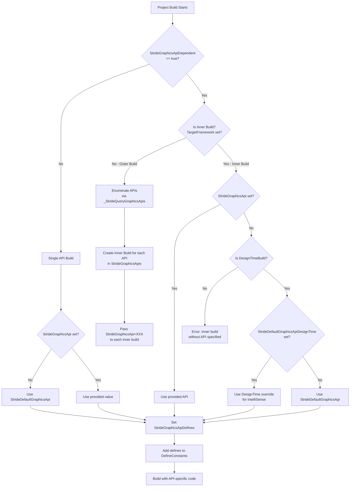

# Graphics API Multi-Targeting System

## Introduction

Stride supports multiple graphics APIs to run on different platforms and hardware configurations:
- **Direct3D 11** - Windows (primary API for compatibility)
- **Direct3D 12** - Windows (modern API with better performance)
- **OpenGL** - Windows, Linux, macOS (desktop OpenGL Core)
- **OpenGLES** - Android, iOS (mobile/embedded OpenGL)
- **Vulkan** - Windows, Linux, Android (modern cross-platform API)

Unlike platform targeting (which uses .NET's `TargetFrameworks`), graphics API targeting is a **Stride-specific build system feature** implemented through MSBuild properties and custom targets.

### Why a Custom System?

Graphics APIs are a **runtime choice**, not a compile-time framework difference. The same `net8.0` or `net8.0-android` binary needs different native graphics drivers and conditional code paths. Stride implements this through:

1. **Compiler defines** - Enable/disable code via `#if STRIDE_GRAPHICS_API_VULKAN`
2. **Separate output folders** - Keep API-specific binaries isolated
3. **NuGet package structure** - Organize libraries by API in packages
4. **Inner build orchestration** - Build each API variant separately

## Key Properties Reference

### Core Properties

| Property | Type | Description | Example Values |
|----------|------|-------------|----------------|
| `StrideGraphicsApis` | String (semicolon-separated) | List of APIs to build for this framework | `Direct3D11;Vulkan` |
| `StrideGraphicsApi` | String | The current API being built (set during inner builds) | `Vulkan` |
| `StrideGraphicsApiDependent` | Boolean | Whether this project needs per-API builds | `true` |
| `StrideGraphicsApiDependentBuildAll` | Boolean | Force enumeration of all APIs (used by CI) | `true` |
| `StrideDefaultGraphicsApi` | String | First API in the list (used as fallback) | `Direct3D11` |
| `StrideDefaultGraphicsApiDesignTime` | String | Override IntelliSense API (optional) | `Vulkan` |
| `StrideGraphicsApiDefines` | String (semicolon-separated) | Compiler defines for current API | See below |

### Per-Framework API Defaults

The default `StrideGraphicsApis` varies by target framework:

```xml
<!-- Desktop Windows (.net8.0-windows) -->
<StrideGraphicsApis>Direct3D11;Direct3D12;OpenGL;OpenGLES;Vulkan</StrideGraphicsApis>

<!-- UWP -->
<StrideDefaultGraphicsApi>Direct3D11</StrideDefaultGraphicsApi>

<!-- Android -->
<StrideDefaultGraphicsApi>OpenGLES</StrideDefaultGraphicsApi>

<!-- iOS -->
<StrideDefaultGraphicsApi>OpenGLES</StrideDefaultGraphicsApi>
```

**Note**: Mobile platforms (Android, iOS, UWP) automatically disable `StrideGraphicsApiDependent` because they only support a single API.

## Compiler Defines Per API

Each graphics API sets specific preprocessor defines:

| API | Defines |
|-----|---------|
| Direct3D 11 | `STRIDE_GRAPHICS_API_DIRECT3D` + `STRIDE_GRAPHICS_API_DIRECT3D11` |
| Direct3D 12 | `STRIDE_GRAPHICS_API_DIRECT3D` + `STRIDE_GRAPHICS_API_DIRECT3D12` |
| OpenGL | `STRIDE_GRAPHICS_API_OPENGL` + `STRIDE_GRAPHICS_API_OPENGLCORE` |
| OpenGLES | `STRIDE_GRAPHICS_API_OPENGL` + `STRIDE_GRAPHICS_API_OPENGLES` |
| Vulkan | `STRIDE_GRAPHICS_API_VULKAN` |
| Null | `STRIDE_GRAPHICS_API_NULL` |

### Usage in Code

```csharp
#if STRIDE_GRAPHICS_API_DIRECT3D
    // Common D3D11 and D3D12 code
    var device = graphicsDevice.NativeDevice as SharpDX.Direct3D11.Device;
#endif

#if STRIDE_GRAPHICS_API_DIRECT3D12
    // D3D12-specific code
    var commandQueue = device.NativeCommandQueue;
#endif

#if STRIDE_GRAPHICS_API_VULKAN
    // Vulkan-specific code
    var vkDevice = graphicsDevice.NativeDevice.Device;
#endif

#if STRIDE_GRAPHICS_API_OPENGL
    // Both OpenGL and OpenGLES
    GL.Clear(ClearBufferMask.ColorBufferBit);
    
    #if STRIDE_GRAPHICS_API_OPENGLCORE
        // Desktop OpenGL only
        GL.Enable(EnableCap.PrimitiveRestart);
    #endif
    
    #if STRIDE_GRAPHICS_API_OPENGLES
        // Mobile OpenGLES only
        GL.Enable(EnableCap.PrimitiveRestartFixedIndex);
    #endif
#endif
```

## How Graphics API is Determined

The build system determines the active graphics API through a multi-stage process:



### Build Flow Details

#### 1. Outer Build (Multi-Targeting Entry Point)

When MSBuild encounters a project with `StrideGraphicsApiDependent=true` and multiple `TargetFrameworks`:

```xml
<Project>
  <PropertyGroup>
    <TargetFrameworks>net8.0;net8.0-android</TargetFrameworks>
    <StrideGraphicsApiDependent>true</StrideGraphicsApiDependent>
  </PropertyGroup>
</Project>
```

MSBuild performs an **outer build** that:
1. Calls `_ComputeTargetFrameworkItems` target
2. For each framework, calls `_StrideQueryGraphicsApis` to get the API list
3. Creates inner builds for each `(Framework, API)` pair
4. Passes `TargetFramework` and `StrideGraphicsApi` to each inner build

#### 2. Inner Build (Actual Compilation)

Each inner build receives:
```
TargetFramework=net8.0
StrideGraphicsApi=Vulkan
```

The inner build then:
1. Sets `StrideGraphicsApiDefines` based on `StrideGraphicsApi`
2. Adds defines to `DefineConstants`
3. Sets output path to `bin\$(Configuration)\$(TargetFramework)\$(StrideGraphicsApi)\`
4. Compiles the code with API-specific defines

#### 3. Design-Time Build (IntelliSense)

Visual Studio and IDEs perform frequent **design-time builds** for IntelliSense. These are marked with `DesignTimeBuild=true`.

For API-dependent projects, the design-time build needs to pick a single API. The priority order is:

1. `StrideDefaultGraphicsApiDesignTime` (if set in `Stride.props`)
2. `StrideDefaultGraphicsApi` (first API in the list)

**Developer Tip**: When working on Vulkan-specific code, uncomment this line in `sources/targets/Stride.props`:

```xml
<!-- Uncomment to make Vulkan the IntelliSense API -->
<StrideDefaultGraphicsApiDesignTime>Vulkan</StrideDefaultGraphicsApiDesignTime>
```

This makes Visual Studio show Vulkan-specific code as active instead of graying it out.

## Output Path Structure

### API-Dependent Projects

Projects with `StrideGraphicsApiDependent=true` organize outputs by API:

```
bin/
└── Release/
    └── net8.0/
        ├── Direct3D11/
        │   ├── Stride.Graphics.dll
        │   ├── Stride.Graphics.pdb
        │   └── Stride.Graphics.xml
        ├── Direct3D12/
        │   ├── Stride.Graphics.dll
        │   └── ...
        ├── Vulkan/
        │   ├── Stride.Graphics.dll
        │   ├── libvulkan-1.dll (native)
        │   └── ...
        ├── OpenGL/
        │   └── ...
        └── OpenGLES/
            └── ...

obj/
└── Release/
    └── net8.0/
        ├── Direct3D11/
        │   └── Stride.Graphics.dll
        ├── Vulkan/
        │   └── Stride.Graphics.dll
        └── ...
```

This is controlled by `Stride.targets`:

```xml
<PropertyGroup Condition="'$(StrideGraphicsApiDependent)' == 'true'">
  <AppendTargetFrameworkToOutputPath>false</AppendTargetFrameworkToOutputPath>
  <AppendRuntimeIdentifierToOutputPath>false</AppendRuntimeIdentifierToOutputPath>
  
  <IntermediateOutputPath>obj\$(Configuration)\$(TargetFramework)\$(StrideGraphicsApi)\</IntermediateOutputPath>
  <OutputPath>bin\$(Configuration)\$(TargetFramework)\$(StrideGraphicsApi)\</OutputPath>
</PropertyGroup>
```

### API-Independent Projects

Regular projects (without `StrideGraphicsApiDependent`) use standard .NET output paths:

```
bin/
└── Release/
    └── net8.0/
        ├── MyGame.dll
        └── MyGame.exe
```

## NuGet Package Structure

### Runtime Library Packages

Stride runtime packages (like `Stride.Graphics`) include all API variants:

```
Stride.Graphics.nupkg
└── lib/
    └── net8.0/
        ├── Stride.Graphics.dll          (placeholder, smallest API)
        ├── Stride.Graphics.xml           (shared documentation)
        ├── Direct3D11/
        │   └── Stride.Graphics.dll
        ├── Direct3D12/
        │   └── Stride.Graphics.dll
        ├── Vulkan/
        │   ├── Stride.Graphics.dll
        │   └── (native Vulkan dependencies)
        ├── OpenGL/
        │   └── Stride.Graphics.dll
        └── OpenGLES/
            └── Stride.Graphics.dll
```

**Important**: The top-level `.dll` is a **placeholder** that allows NuGet to recognize the package as compatible with `net8.0`. The actual API-specific DLLs are in subfolders.

### How Package Resolution Works

When you reference `Stride.Graphics` in your game project, the build system uses special targets to resolve the correct API variant:

#### For PackageReference (NuGet Packages)

`Stride.GraphicsApi.PackageReference.targets` handles package resolution:

```xml
<Target Name="_StridePackageReferenceResolveGraphicsApi" AfterTargets="ResolvePackageAssets">
  <!-- Determine current API -->
  <PropertyGroup>
    <_StrideGraphicsApiCurrent>$(StrideGraphicsApi)</_StrideGraphicsApiCurrent>
    <_StrideGraphicsApiCurrent Condition="'$(_StrideGraphicsApiCurrent)' == ''">$(StrideDefaultGraphicsApi)</_StrideGraphicsApiCurrent>
  </PropertyGroup>
  
  <!-- Find API-specific subfolder -->
  <ItemGroup>
    <_StrideGraphicsRuntimeCopyLocalFodlers Include="@(RuntimeCopyLocalItems->'%(RootDir)%(Directory)$(_StrideGraphicsApiCurrent)')" 
            Condition="Exists('%(RootDir)%(Directory)$(_StrideGraphicsApiCurrent)')">
    </_StrideGraphicsRuntimeCopyLocalFodlers>
    
    <!-- Remove placeholder DLL -->
    <RuntimeCopyLocalItems Remove="@(RuntimeCopyLocalItems)" 
            Condition="Exists('%(RootDir)%(Directory)$(_StrideGraphicsApiCurrent)\')">
    </RuntimeCopyLocalItems>
  </ItemGroup>
  
  <!-- Add API-specific DLLs -->
  <CreateItem Include="@(_StrideGraphicsRuntimeCopyLocalFodlers->'%(Identity)\*.dll')">
    <Output TaskParameter="Include" ItemName="RuntimeCopyLocalItems" />
  </CreateItem>
</Target>
```

**Flow**:
1. Checks `$(StrideGraphicsApi)` (e.g., `Vulkan`)
2. Looks for `lib/net8.0/Vulkan/` subfolder in package
3. Removes the placeholder `lib/net8.0/Stride.Graphics.dll`
4. Adds `lib/net8.0/Vulkan/Stride.Graphics.dll` to build output

#### For ProjectReference (Development)

When building from source, `Stride.GraphicsApi.Dev.targets` handles project-to-project references:

```xml
<Target Name="_StrideProjectReferenceGraphicsApiDependent" BeforeTargets="PrepareProjectReferences">
  <!-- Query referenced projects for StrideGraphicsApiDependent -->
  <MSBuild Projects="@(_MSBuildProjectReferenceExistent)"
           Targets="_StrideQueryGraphicsApiDependent"
           SkipNonexistentTargets="true">
    <Output ItemName="_StrideGraphicsApiDependentItems" TaskParameter="TargetOutputs" />
  </MSBuild>
  
  <!-- Pass current API to dependent projects -->
  <ItemGroup>
    <_MSBuildProjectReferenceExistent Condition="'%(_StrideGraphicsApiDependentItems.StrideGraphicsApiDependent)' == 'true'">
      <StrideGraphicsApi>$(_StrideGraphicsApiCurrent)</StrideGraphicsApi>
      <SetTargetFramework>%(SetTargetFramework);StrideGraphicsApi=$(_StrideGraphicsApiCurrent)</SetTargetFramework>
    </_MSBuildProjectReferenceExistent>
  </ItemGroup>
</Target>
```

**Flow**:
1. For each `<ProjectReference>`, query if it has `StrideGraphicsApiDependent=true`
2. If yes, pass current `StrideGraphicsApi` to that project
3. If no, remove `StrideGraphicsApi` from build properties (avoid unnecessary rebuilds)

### Reference Chain Example

```
MyGame.csproj (no API dependency)
  └── References: Stride.Engine
      ├── StrideGraphicsApiDependent=false
      └── References: Stride.Graphics
          ├── StrideGraphicsApiDependent=true
          └── Built with API=$(StrideGraphicsApi from MyGame)
```

When building `MyGame` with `StrideGraphicsApi=Vulkan`:
1. `MyGame` builds normally (no API variant)
2. `Stride.Engine` receives `StrideGraphicsApi=Vulkan` but ignores it (not API-dependent)
3. `Stride.Graphics` receives `StrideGraphicsApi=Vulkan` and builds the Vulkan variant
4. Final output: `MyGame.exe` + `Stride.Engine.dll` + `Stride.Graphics.dll` (Vulkan)

## Building for Specific Graphics APIs

### Command Line Builds

#### Build Single API

```powershell
# Build only Vulkan variant
dotnet build Stride.Graphics.csproj /p:StrideGraphicsApis=Vulkan

# Build only Direct3D11
dotnet build Stride.Graphics.csproj /p:StrideGraphicsApis=Direct3D11

# Build two specific APIs
dotnet build Stride.Graphics.csproj "/p:StrideGraphicsApis=Vulkan;Direct3D12"
```

#### Build All APIs (CI/Release)

```powershell
# Force build all APIs (ignores user override)
dotnet build Stride.sln /p:StrideGraphicsApiDependentBuildAll=true

# Build with specific API subset
dotnet build Stride.sln /p:StrideGraphicsApiDependentBuildAll=true "/p:StrideGraphicsApis=Direct3D11;Vulkan"
```

**Note**: `StrideGraphicsApiDependentBuildAll=true` ensures that even if a developer has overridden `StrideGraphicsApis` locally, the CI build will use all APIs.

### Visual Studio / Rider Development

For day-to-day development, you typically don't need to build all API variants. Pick the API you're working with:

#### Option 1: Project File Override

Add this to your local `.csproj.user` file (not committed):

```xml
<Project>
  <PropertyGroup>
    <StrideGraphicsApis>Vulkan</StrideGraphicsApis>
  </PropertyGroup>
</Project>
```

#### Option 2: Directory.Build.props Override

Create a `Directory.Build.props` in the root (not committed):

```xml
<Project>
  <PropertyGroup>
    <StrideGraphicsApis Condition="'$(StrideGraphicsApiDependentBuildAll)' != 'true'">Vulkan</StrideGraphicsApis>
  </PropertyGroup>
</Project>
```

The condition ensures CI builds still use all APIs.

#### Option 3: Build Configuration

Create a custom build configuration in Visual Studio:
1. Configuration Manager → New Solution Configuration → "Debug-Vulkan"
2. Edit solution `.sln.DotSettings` or use MSBuild properties

### Full Engine Build (All Platforms + APIs)

The official build script handles all combinations:

```powershell
# Build all platforms and all graphics APIs
.\build\compile.bat

# Or use MSBuild directly
msbuild build\Stride.build /t:Build /p:StrideGraphicsApiDependentBuildAll=true
```

This builds:
- Windows: Direct3D11, Direct3D12, OpenGL, OpenGLES, Vulkan
- Linux: OpenGL, Vulkan
- Android: OpenGLES, Vulkan
- iOS: OpenGLES
- UWP: Direct3D11

## IntelliSense and IDE Configuration

### Problem: Grayed Out Code

When working on API-specific code, you might see:

```csharp
#if STRIDE_GRAPHICS_API_VULKAN
    // This code appears grayed out in Visual Studio
    var device = graphicsDevice.NativeDevice.Device;
#endif
```

This happens because IntelliSense uses the **design-time API**, which defaults to the first API in the list (usually `Direct3D11`).

### Solution 1: Override Design-Time API (Recommended)

Edit `sources/targets/Stride.props` and uncomment:

```xml
<PropertyGroup>
  <!-- Uncomment and set to the API you're working on -->
  <StrideDefaultGraphicsApiDesignTime>Vulkan</StrideDefaultGraphicsApiDesignTime>
</PropertyGroup>
```

**Pros**: 
- Works for all projects
- IntelliSense works correctly
- No need to modify project files

**Cons**: 
- Needs to be changed when switching API focus
- Not committed (personal preference)

### Solution 2: Limit Built APIs

Edit your local `Directory.Build.props`:

```xml
<Project>
  <PropertyGroup>
    <!-- Only build Vulkan during development -->
    <StrideGraphicsApis Condition="'$(StrideGraphicsApiDependentBuildAll)' != 'true'">Vulkan</StrideGraphicsApis>
  </PropertyGroup>
</Project>
```

**Pros**:
- Faster builds (only one API)
- IntelliSense matches build

**Cons**:
- Don't commit this file (breaks CI)
- Need to remove when testing other APIs

### Solution 3: Use #define at File Level (Not Recommended)

```csharp
// Add at the top of specific files for IntelliSense only
#define STRIDE_GRAPHICS_API_VULKAN

#if STRIDE_GRAPHICS_API_VULKAN
    // Now IntelliSense works here
#endif
```

**Pros**: 
- Quick per-file fix

**Cons**:
- Easy to forget and commit
- Can cause confusion about actual build defines
- Doesn't help with errors from other files

### C# DevKit / OmniSharp Configuration

For VS Code or other OmniSharp-based editors, create `.vscode/settings.json`:

```json
{
  "msbuild.configuration": {
    "StrideGraphicsApis": "Vulkan",
    "StrideDefaultGraphicsApiDesignTime": "Vulkan"
  }
}
```

## How to Make a Project API-Dependent

### Step 1: Add Property to .csproj

```xml
<Project>
  <PropertyGroup>
    <StrideGraphicsApiDependent>true</StrideGraphicsApiDependent>
  </PropertyGroup>
  
  <Import Project="..\..\targets\Stride.props" />
  <!-- Rest of project -->
</Project>
```

**Important**: Add this **before** importing `Stride.props`.

### Step 2: Use API-Specific Code

```csharp
public class GraphicsBackend
{
#if STRIDE_GRAPHICS_API_DIRECT3D11
    public void Initialize()
    {
        // D3D11 initialization
    }
#elif STRIDE_GRAPHICS_API_VULKAN
    public void Initialize()
    {
        // Vulkan initialization
    }
#else
    public void Initialize()
    {
        throw new PlatformNotSupportedException();
    }
#endif
}
```

### Step 3: Update NuGet Package (if applicable)

If this project is packaged, ensure the `.nuspec` or SDK-style package settings include:

```xml
<PropertyGroup>
  <!-- Let Stride targets handle the multi-API layout -->
  <IncludeBuildOutput>true</IncludeBuildOutput>
</PropertyGroup>
```

The `Stride.GraphicsApi.Dev.targets` automatically adjusts `TargetPath` for each API variant during pack.

### Example: Complete API-Dependent Project

```xml
<Project>
  <PropertyGroup>
    <StrideRuntime>true</StrideRuntime>
    <StrideGraphicsApiDependent>true</StrideGraphicsApiDependent>
    <TargetFrameworks>net8.0;net8.0-android</TargetFrameworks>
  </PropertyGroup>
  
  <Import Project="..\..\targets\Stride.props" />
  
  <!-- API-specific dependencies -->
  <ItemGroup Condition=" '$(StrideGraphicsApi)' == 'Vulkan' ">
    <StrideNativeLib Include="..\..\..\deps\MoltenVK\$(StridePlatformDeps)\**\*.*">
      <CopyToOutputDirectory>PreserveNewest</CopyToOutputDirectory>
    </StrideNativeLib>
  </ItemGroup>
  
  <Import Project="..\..\targets\Stride.targets" />
</Project>
```

This project will build:
- `net8.0` → Direct3D11, Direct3D12, OpenGL, OpenGLES, Vulkan (5 variants)
- `net8.0-android` → OpenGLES (1 variant, API-dependent disabled on mobile)
- Total: 6 output DLLs

## Troubleshooting Common Issues

### Issue 1: "The current project references both API variants"

**Error**:
```
error CS0433: The type 'GraphicsDevice' exists in both 
'Stride.Graphics, Version=1.0.0.0, Culture=neutral' and 
'Stride.Graphics, Version=1.0.0.0, Culture=neutral'
```

**Cause**: Your project is copying multiple API variants of the same DLL to the output directory.

**Solution**: Check that:
1. Your project doesn't have `StrideGraphicsApiDependent=true` (unless it needs it)
2. You're not manually copying API-specific DLLs
3. Clear `bin/` and `obj/` folders and rebuild

```powershell
# Clean all build artifacts
git clean -xfd
dotnet build
```

### Issue 2: "Missing Graphics API DLL at runtime"

**Error**: Application crashes with `FileNotFoundException` for `Stride.Graphics.dll`.

**Cause**: The package resolution didn't copy the correct API variant.

**Debug Steps**:
1. Check your game's output folder - which DLLs are present?
2. Check if `Stride.Graphics.dll` is there and not 0 bytes (placeholder)
3. Verify `StrideGraphicsApi` or `StrideGraphicsApis` is set

**Solution**:
```xml
<!-- In your game.csproj -->
<PropertyGroup>
  <StrideGraphicsApis Condition="'$(StrideGraphicsApis)' == ''">Direct3D11</StrideGraphicsApis>
</PropertyGroup>
```

### Issue 3: "Build takes too long, building all APIs"

**Symptom**: Building a single project takes 5x longer than expected.

**Cause**: You have `StrideGraphicsApiDependent=true` but don't actually need per-API builds.

**Solution**: 
- Remove `StrideGraphicsApiDependent` from your project if you don't use API-specific code
- OR limit APIs during development (see "IntelliSense Configuration")

### Issue 4: "IntelliSense shows wrong API code"

**Symptom**: Code for Vulkan appears grayed out, but you're building for Vulkan.

**Cause**: Design-time build uses a different API than your inner build.

**Solution**: Set `StrideDefaultGraphicsApiDesignTime` (see "IntelliSense Configuration" section).

### Issue 5: "API-dependent project not rebuilding"

**Symptom**: Changed API-specific code, but output DLL didn't change.

**Cause**: Incremental build system didn't detect the API parameter change.

**Solution**:
```powershell
# Force rebuild of specific API
dotnet build -c Release /p:StrideGraphicsApis=Vulkan /t:Rebuild

# Or clean first
dotnet clean
dotnet build /p:StrideGraphicsApis=Vulkan
```

### Issue 6: "NuGet package missing API folders"

**Symptom**: Published NuGet package only contains top-level DLL, no API subfolders.

**Cause**: The `_StridePackUpdateOutputTargetPath` target didn't run during pack.

**Solution**: Ensure `Stride.targets` is imported:

```xml
<Project>
  <PropertyGroup>
    <StrideGraphicsApiDependent>true</StrideGraphicsApiDependent>
  </PropertyGroup>
  
  <Import Project="..\..\targets\Stride.props" />
  <!-- ... -->
  <Import Project="..\..\targets\Stride.targets" /> <!-- REQUIRED -->
</Project>
```

Then pack with:
```powershell
dotnet pack -c Release /p:StrideGraphicsApiDependentBuildAll=true
```

## Best Practices

### For Engine Contributors

1. **Only mark projects API-dependent if necessary**
   - Does the project use `#if STRIDE_GRAPHICS_API_*`?
   - Does the project reference API-dependent native libraries?
   - If no to both, don't use `StrideGraphicsApiDependent=true`

2. **Use the most specific defines**
   ```csharp
   // Good: Specific to D3D12
   #if STRIDE_GRAPHICS_API_DIRECT3D12
       var commandQueue = ...;
   #endif
   
   // Better: Share code between D3D11 and D3D12
   #if STRIDE_GRAPHICS_API_DIRECT3D
       var device = ...;
   #endif
   
   // Best: Only add API-specific code where unavoidable
   public void Initialize()
   {
       // Common initialization
       
       #if STRIDE_GRAPHICS_API_VULKAN
       InitializeVulkanSpecific();
       #endif
   }
   ```

3. **Limit development builds to 1-2 APIs**
   - Use `Directory.Build.props` override
   - Only build all APIs in CI
   - Keep local builds fast

4. **Test with multiple APIs**
   - Even if you develop with Vulkan, test with Direct3D11
   - Different APIs expose different bugs
   - Use CI to ensure all APIs compile

5. **Document API-specific behavior**
   ```csharp
   /// <summary>
   /// Creates a compute shader.
   /// </summary>
   /// <remarks>
   /// <para><b>Direct3D 11/12:</b> Uses CS_5_0 profile.</para>
   /// <para><b>Vulkan:</b> Uses SPIR-V.</para>
   /// <para><b>OpenGL:</b> Uses GLSL compute shaders (4.3+).</para>
   /// </remarks>
   public ComputeShader CreateComputeShader(byte[] bytecode) { ... }
   ```

### For Game Developers

1. **Use default API for your platform**
   - Windows: `Direct3D11` (best compatibility)
   - Linux: `OpenGL` or `Vulkan`
   - Android: `OpenGLES` or `Vulkan`

2. **Don't make game projects API-dependent**
   - Game code should be API-agnostic
   - Use Stride abstractions (`GraphicsDevice`, `CommandList`, etc.)
   - Let the engine handle API differences

3. **Allow users to choose API at runtime**
   ```csharp
   // In your Game class
   public Game()
   {
       // Let Stride pick the best API
       GraphicsDeviceManager.PreferredGraphicsProfile = new[] 
       { 
           GraphicsProfile.Level_11_0,
           GraphicsProfile.Level_10_0 
       };
       
       // Or force a specific API (advanced)
       #if STRIDE_PLATFORM_WINDOWS
       GraphicsDeviceManager.PreferredGraphicsApi = GraphicsApi.Vulkan;
       #endif
   }
   ```

4. **Test on target hardware**
   - API support varies by GPU
   - Vulkan requires newer drivers
   - Direct3D 12 requires Windows 10+
   - OpenGL has varying quality on different drivers

5. **Include multiple API DLLs in published games**
   - Users may have different hardware
   - Let Stride fallback to another API if preferred one fails
   - The size increase is minimal (a few MB)

### For CI/CD Pipelines

1. **Always use `StrideGraphicsApiDependentBuildAll=true`**
   ```yaml
   - name: Build Stride
     run: dotnet build -c Release /p:StrideGraphicsApiDependentBuildAll=true
   ```

2. **Verify all API variants in packages**
   ```powershell
   # After pack, check package contents
   Expand-Archive Stride.Graphics.nupkg -DestinationPath temp
   Get-ChildItem temp/lib/net8.0/ -Recurse
   
   # Should show:
   # Direct3D11/Stride.Graphics.dll
   # Direct3D12/Stride.Graphics.dll
   # Vulkan/Stride.Graphics.dll
   # OpenGL/Stride.Graphics.dll
   # OpenGLES/Stride.Graphics.dll
   ```

3. **Run tests with different APIs**
   ```yaml
   - name: Test Direct3D11
     run: dotnet test /p:StrideGraphicsApis=Direct3D11
   
   - name: Test Vulkan
     run: dotnet test /p:StrideGraphicsApis=Vulkan
   ```

4. **Cache API-specific build outputs separately**
   ```yaml
   - uses: actions/cache@v3
     with:
       path: |
         **/bin/**/Direct3D11
         **/bin/**/Vulkan
       key: stride-build-${{ hashFiles('**/*.csproj') }}
   ```

## Architectural Diagrams

### Build Flow for API-Dependent Project

```
┌─────────────────────────────────────────────────────────────────┐
│ dotnet build Stride.Graphics.csproj                             │
│ TargetFrameworks=net8.0;net8.0-android                          │
│ StrideGraphicsApiDependent=true                                 │
└────────────────────────────┬────────────────────────────────────┘
                             │
                             ▼
                    ┌────────────────┐
                    │ Outer Build    │
                    │ (Orchestrator) │
                    └────────┬───────┘
                             │
        ┏━━━━━━━━━━━━━━━━━━━━┻━━━━━━━━━━━━━━━━━━━━┓
        ▼                                          ▼
┌───────────────┐                        ┌───────────────┐
│ net8.0        │                        │ net8.0-android│
│ TFM Build     │                        │ TFM Build     │
└───────┬───────┘                        └───────┬───────┘
        │                                        │
        │ _StrideQueryGraphicsApis               │ _StrideQueryGraphicsApis
        ▼                                        ▼
┌───────────────┐                        ┌───────────────┐
│ StrideGraphics│                        │ Disable API   │
│ Apis=D3D11;   │                        │ Dependent     │
│ D3D12;OpenGL; │                        │ (Mobile has   │
│ OpenGLES;     │                        │ only 1 API)   │
│ Vulkan        │                        │               │
└───────┬───────┘                        └───────┬───────┘
        │                                        │
        │ Split into inner builds                │ Single build
        ▼                                        ▼
┌─────────────────────────────────┐    ┌──────────────────┐
│ 5 Inner Builds (Parallel)       │    │ 1 Inner Build    │
├─────────────────────────────────┤    ├──────────────────┤
│ 1. TF=net8.0, API=Direct3D11    │    │ TF=net8.0-android│
│    ├─ Set defines: STRIDE_...   │    │ API=OpenGLES     │
│    ├─ OutputPath: .../D3D11/    │    │ (automatic)      │
│    └─ Compile                   │    ├─ OutputPath:     │
│                                 │    │    .../           │
│ 2. TF=net8.0, API=Direct3D12    │    └─ Compile         │
│    └─ ...                       │    │                  │
│                                 │    └──────────────────┘
│ 3. TF=net8.0, API=OpenGL        │
│    └─ ...                       │
│                                 │
│ 4. TF=net8.0, API=OpenGLES      │
│    └─ ...                       │
│                                 │
│ 5. TF=net8.0, API=Vulkan        │
│    └─ ...                       │
└─────────────────────────────────┘
        │                                        │
        ▼                                        ▼
┌─────────────────────────────────┐    ┌──────────────────┐
│ bin/Release/net8.0/             │    │ bin/Release/     │
│ ├─ Direct3D11/                  │    │   net8.0-android/│
│ │  └─ Stride.Graphics.dll       │    │ └─ Stride.Graph  │
│ ├─ Direct3D12/                  │    │    ics.dll       │
│ │  └─ Stride.Graphics.dll       │    └──────────────────┘
│ ├─ OpenGL/                      │
│ │  └─ Stride.Graphics.dll       │
│ ├─ OpenGLES/                    │
│ │  └─ Stride.Graphics.dll       │
│ └─ Vulkan/                      │
│    └─ Stride.Graphics.dll       │
│    └─ libvulkan-1.dll (native)  │
└─────────────────────────────────┘
```

### Package Resolution Flow

```
┌───────────────────────────────────────────────────────────┐
│ Game Project Build                                        │
│ <PackageReference Include="Stride.Graphics" />            │
│ StrideGraphicsApi=Vulkan (from game settings)             │
└────────────────────────┬──────────────────────────────────┘
                         │
                         ▼
        ┌────────────────────────────────┐
        │ NuGet Restore                  │
        │ Downloads Stride.Graphics.nupkg│
        └────────────┬───────────────────┘
                     │
                     ▼
┌────────────────────────────────────────────────────────────┐
│ Package Contents:                                          │
│ lib/net8.0/                                                │
│ ├─ Stride.Graphics.dll (placeholder, 4 KB)                 │
│ ├─ Stride.Graphics.xml                                     │
│ ├─ Direct3D11/                                             │
│ │  └─ Stride.Graphics.dll (real DLL, 2 MB)                 │
│ ├─ Direct3D12/                                             │
│ │  └─ Stride.Graphics.dll                                  │
│ ├─ Vulkan/                                                 │
│ │  ├─ Stride.Graphics.dll                                  │
│ │  └─ libvulkan-1.dll                                      │
│ └─ ...                                                     │
└────────────────────────┬───────────────────────────────────┘
                         │
                         ▼
        ┌────────────────────────────────────┐
        │ ResolvePackageAssets               │
        │ (Standard .NET SDK target)         │
        │ Creates RuntimeCopyLocalItems:     │
        │ - Stride.Graphics.dll (placeholder)│
        └────────────┬───────────────────────┘
                     │
                     ▼
┌────────────────────────────────────────────────────────────┐
│ _StridePackageReferenceResolveGraphicsApi                  │
│ (Custom Stride target, AfterTargets="ResolvePackageAssets")│
├────────────────────────────────────────────────────────────┤
│ 1. Get current API: StrideGraphicsApi=Vulkan               │
│                                                            │
│ 2. Find API subfolder:                                     │
│    .../lib/net8.0/Vulkan/                                  │
│                                                            │
│ 3. Remove placeholder:                                     │
│    RuntimeCopyLocalItems -= Stride.Graphics.dll            │
│    (from lib/net8.0/)                                      │
│                                                            │
│ 4. Add API-specific DLLs:                                  │
│    RuntimeCopyLocalItems += lib/net8.0/Vulkan/*.dll        │
│    RuntimeCopyLocalItems += lib/net8.0/Vulkan/*.exe        │
│                                                            │
│ 5. Update metadata:                                        │
│    DestinationSubPath = Stride.Graphics.dll (flat)         │
│    PathInPackage = lib/net8.0/Vulkan/Stride.Graphics.dll   │
└────────────────────────┬───────────────────────────────────┘
                         │
                         ▼
        ┌────────────────────────────────┐
        │ CopyFilesToOutputDirectory     │
        │ Copies RuntimeCopyLocalItems   │
        │ to game output folder          │
        └────────────┬───────────────────┘
                     │
                     ▼
┌────────────────────────────────────────────────────────────┐
│ Game Output (bin/Release/net8.0/)                          │
│ ├─ MyGame.dll                                              │
│ ├─ MyGame.exe                                              │
│ ├─ Stride.Engine.dll                                       │
│ ├─ Stride.Graphics.dll (Vulkan variant)                    │
│ └─ libvulkan-1.dll                                         │
└────────────────────────────────────────────────────────────┘
```

## Advanced Topics

### Custom Graphics API

If you need to add a new graphics API (e.g., Metal, WebGPU):

1. **Add API name to default list** in `Stride.props`:
   ```xml
   <StrideGraphicsApis>Direct3D11;Direct3D12;OpenGL;OpenGLES;Vulkan;Metal</StrideGraphicsApis>
   ```

2. **Add defines** in `Stride.props` and `Stride.targets`:
   ```xml
   <PropertyGroup Condition=" '$(StrideGraphicsApi)' == 'Metal' ">
     <StrideGraphicsApiDefines>STRIDE_GRAPHICS_API_METAL</StrideGraphicsApiDefines>
   </PropertyGroup>
   ```

3. **Implement backend** in `Stride.Graphics`:
   ```csharp
   #if STRIDE_GRAPHICS_API_METAL
   public class GraphicsAdapterMetal : GraphicsAdapter { ... }
   #endif
   ```

4. **Add platform restriction** (if needed):
   ```xml
   <PropertyGroup Condition="'$(StrideGraphicsApiDependent)' == 'true' And '$(TargetFramework)' == '$(StrideFrameworkiOS)'">
     <StrideGraphicsApiDependent>false</StrideGraphicsApiDependent>
     <StrideGraphicsApi>Metal</StrideGraphicsApi>
   </PropertyGroup>
   ```

### Mixing API-Dependent and Independent Projects

**Scenario**: You have a utility library that doesn't need API-specific code, but it's referenced by `Stride.Graphics` (which is API-dependent).

**Problem**: The utility library might be built multiple times unnecessarily.

**Solution**: The build system handles this automatically through `_StrideProjectReferenceGraphicsApiDependent` target:

```xml
<!-- In the utility library.csproj -->
<Project>
  <!-- NO StrideGraphicsApiDependent here -->
  <Import Project="Stride.props" />
</Project>
```

When `Stride.Graphics` (Vulkan variant) references this library:
1. Build system queries: "Is utility library API-dependent?"
2. Answer: No (`StrideGraphicsApiDependent` not set)
3. Build system removes `StrideGraphicsApi` property when building utility library
4. Utility library builds once, shared by all API variants

**Output**:
```
UtilityLibrary/bin/Release/net8.0/
└── UtilityLibrary.dll (built once)

Stride.Graphics/bin/Release/net8.0/
├── Vulkan/
│   └── Stride.Graphics.dll (references UtilityLibrary.dll)
└── Direct3D11/
    └── Stride.Graphics.dll (also references same UtilityLibrary.dll)
```

## Summary

The Stride Graphics API multi-targeting system provides:

- ✅ **Compile-time code paths** via preprocessor defines
- ✅ **Per-API build outputs** organized in subfolders
- ✅ **Automatic NuGet package resolution** with the correct API variant
- ✅ **Project reference propagation** of API settings
- ✅ **IntelliSense control** for development productivity
- ✅ **CI/CD flexibility** to build all or specific APIs

**Key Takeaways**:
- Use `StrideGraphicsApiDependent=true` only for projects with API-specific code
- Limit API variants during development for faster builds
- Override `StrideDefaultGraphicsApiDesignTime` for IntelliSense
- Always build all APIs in CI with `StrideGraphicsApiDependentBuildAll=true`
- NuGet packages contain all API variants in subfolders
- Game projects should remain API-agnostic

For further details, see:
- [01-build-system-overview.md](01-build-system-overview.md) - Overall build system architecture
- [02-platform-targeting.md](02-platform-targeting.md) - Platform multi-targeting with TargetFrameworks
- Source files: `sources/targets/Stride.props`, `Stride.targets`, `Stride.GraphicsApi.Dev.targets`, `Stride.GraphicsApi.PackageReference.targets`
