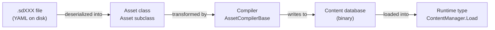

# Asset System —  Overview

This document explains the Stride asset system. It covers the complete pipeline from design-time authoring through build compilation to runtime loading, and shows how all parts are wired together.

> **For game-project custom assets** (not engine contributions), the same pipeline applies with minor differences noted in each spoke file. See also the external guide: [Creating custom assets](https://doc.stride3d.net/latest/en/manual/scripts/custom-assets.html).

## The Three-Phase Pipeline

**Design time:** The author edits asset properties in GameStudio. Properties are persisted to a `.sdXXX` YAML file. The file is deserialized into an instance of the asset class.

**Build time:** The build pipeline invokes the compiler registered for the asset type. The compiler reads the asset class instance and produces compiled binary content, which is written to the content database.

**Runtime:** The game calls `ContentManager.Load<RuntimeType>(url)`. The engine reads the compiled binary and returns a typed instance.

## Assembly Map

| Layer | Key Type | Assembly | Location |
|---|---|---|---|
| Runtime type | `DataContract`-decorated class | Engine feature assembly (e.g. `Stride.Graphics`) | `sources/engine/` |
| Asset class | `Asset` subclass | `Stride.Assets` or feature assembly (e.g. `Stride.Assets.Models`) | `sources/engine/` |
| Compiler | `AssetCompilerBase` subclass | Same assembly as the asset class | `sources/engine/` (same folder as asset class) |
| Editor Tier 2 | `AssetViewModel<T>` subclass | `Stride.Assets.Presentation` | `sources/editor/Stride.Assets.Presentation/ViewModel/` |
| Editor Tier 3 VM | `AssetEditorViewModel` subclass | `Stride.Assets.Presentation` | `sources/editor/Stride.Assets.Presentation/AssetEditors/` |
| Editor Tier 3 View | `IEditorView` XAML control | `Stride.Assets.Presentation` | `sources/editor/Stride.Assets.Presentation/AssetEditors/` |
| Template | `.sdtpl` YAML file | `Stride.Assets.Presentation` | `sources/editor/Stride.Assets.Presentation/Templates/Assets/` |

## Choose a Base Class for the Asset

> **Decision tree:**
>
> - Does the asset import its primary content from an external file (`.fbx`, `.png`, `.wav`...)?
>   → **`AssetWithSource`** (provides a `Source: UFile` property)
> - Does the asset have named sub-parts with parent/child hierarchy (like scenes or prefabs)?
>   → **`AssetCompositeHierarchy`**
> - Does the asset have named sub-parts in a flat, unordered collection?
>   → **`AssetComposite`**
> - Otherwise → **`Asset`**

See [asset-class.md](asset-class.md) for the full base-class selection table.

## Choose an Editor Tier

> **Decision tree:**
>
> - Does the asset need a dedicated editor panel (canvas, node graph, timeline...)?
>   → **Tier 3** — custom `AssetEditorViewModel` + XAML view
> - Does the asset need custom commands, computed display properties, or custom drag-and-drop?
>   → **Tier 2** — custom `AssetViewModel<T>`
> - Otherwise the property grid is sufficient.
>   → **Tier 1** — no editor code needed

See [editor.md](editor.md) for implementation details for each tier.

## Implementation Checklist

Use this checklist when adding a new asset type. Steps marked **optional** are only needed in specific circumstances.

### Always required

- [ ] **Runtime type** — `[DataContract]`, `[ContentSerializer]`, `[ReferenceSerializer]`, `[DataSerializerGlobal]` → see [runtime-type.md](runtime-type.md)
- [ ] **Asset class** — `[DataContract]`, `[AssetDescription]`; add `[AssetContentType]` and `[AssetFormatVersion]` when the asset has a compiled runtime output → see [asset-class.md](asset-class.md)
- [ ] **Compiler** — `[AssetCompiler(typeof(%%Asset%%), typeof(AssetCompilationContext))]` on the compiler class; implement the protected `Prepare` override → see [compiler.md](compiler.md)
- [ ] **Module initializer** — `AssemblyRegistry.Register(...)` in the assembly's `Module.cs` → see [registration.md](registration.md)

### Recommended

- [ ] **`.sdtpl` template** — adds the asset to the **Add Asset** menu in GameStudio → see [registration.md](registration.md#sdtpl-template-files-new-asset-menu)

### Conditional

- [ ] **`AssetViewModel<T>` (Tier 2)** — only if custom editor commands or display logic is needed → see [editor.md](editor.md#tier-2-custom-assetviewmodelt)
- [ ] **`AssetEditorViewModel` + XAML View (Tier 3)** — only if a dedicated editor panel is needed → see [editor.md](editor.md#tier-3-full-custom-editor)
- [ ] **`GetInputFiles` override** — only if the compiler reads external files → see [compiler.md](compiler.md#declare-external-file-dependencies-getinputfiles)
- [ ] **`GetInputTypes` override** — only if compilation depends on another asset being compiled first → see [compiler.md](compiler.md#declare-asset-dependencies-getinputtypes)
- [ ] **Version upgrader** — only when bumping `[AssetFormatVersion]` on an existing asset → see [asset-class.md](asset-class.md#versioning-and-upgraders)

## Key Terms

| Term | Definition |
|---|---|
| Asset class | C# class inheriting `Asset`. Design-time representation. Serialized to a `.sdXXX` YAML file. |
| Runtime type | C# class loaded by `ContentManager` at runtime. Compiled binary form of an asset. |
| `AssetItem` | Wrapper pairing an `Asset` instance with its on-disk location and owning package. |
| Content database | Binary storage produced by the build pipeline and consumed by `ContentManager`. |
| `AssetRegistry` | Static registry mapping asset types to file extensions, compilers, runtime types, and factories. Populated automatically from attributes during assembly registration. |
| Quantum | Stride's introspection framework (`Stride.Core.Quantum`). Builds a node graph from asset properties for use in the property grid and undo/redo. See also the [asset introspection doc](https://doc.stride3d.net/latest/en/manual/engine/asset-introspection.html). |
| `.sdXXX` | The file extension used by Stride asset files. Format is YAML. The extension is registered via `[AssetDescription]`. |
| `AssetCompilationContext` | The standard compilation context for game assets. Pass as the second argument to `[AssetCompiler]`. |
