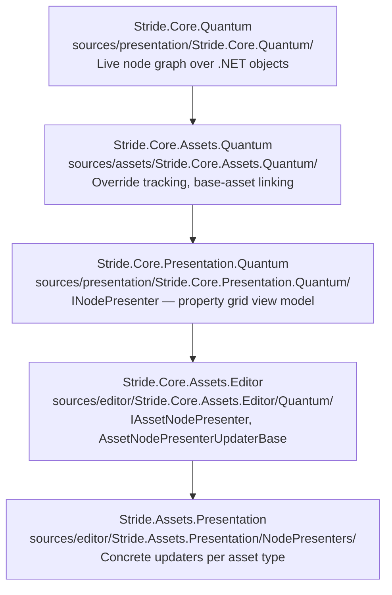

# Quantum — Contributor Overview

Quantum is Stride's graph-based introspection framework. It wraps any .NET object hierarchy into a typed node graph, and that graph is the single source of truth for three things: **property grid display**, **undo/redo**, and **asset override tracking** (the "bold = overridden" behaviour in prefab/archetype workflows).

## Layers

## Data Flow

1. **Asset opens** — `AssetPropertyGraph` (created via `AssetQuantumRegistry.ConstructPropertyGraph` with the session's `AssetPropertyGraphContainer`) calls `GetOrCreateNode(asset)` on the underlying `NodeContainer` to build the core graph.
2. **Override semantics** — `AssetPropertyGraph` links each node to its counterpart in the base asset graph (if any) and marks inherited vs. overridden values.
3. **Presenter tree** — `AssetNodePresenterFactory` walks the node graph and creates one `IAssetNodePresenter` per node.
4. **Updaters run** — all registered `INodePresenterUpdater` implementations get `UpdateNode()` called per node, then `FinalizeTree()` called once for the full tree.
5. **Property grid binds** — the WPF property grid binds to the presenter tree: `DisplayName` → label, `Value/UpdateValue` → input control, `IsVisible/IsReadOnly` → visibility and editability, `AttachedProperties` → input constraints.

## When You Need Quantum

> **Decision tree:**
>
> - Adding a new asset type with default property grid display?
>   → **No Quantum code needed.** `[DataMember]` and `[Display]` attributes on the asset class
>   are sufficient. See [asset-system/README.md](../asset-system/README.md).
>
> - Customising visibility, display names, numeric constraints, or computed properties
>   for a new or existing asset?
>   → **Write an `INodePresenterUpdater`.** See [property-grid.md](property-grid.md).
>
> - Asset class holds members that are references to other content objects (Prefabs, Textures)?
>   → **Write an `AssetPropertyGraphDefinition`.** See [asset-graph.md](asset-graph.md).
>
> - Custom override or inheritance behaviour (rare — scenes and prefabs already cover this)?
>   → **Subclass `AssetPropertyGraph`.** See [asset-graph.md](asset-graph.md).

## Spoke Files

| File | Covers |
|---|---|
| [graph-model.md](graph-model.md) | `IGraphNode`, `IObjectNode`, `IMemberNode`, `NodeContainer`, mutations, change listeners |
| [asset-graph.md](asset-graph.md) | `AssetPropertyGraph`, override model, `AssetPropertyGraphDefinition`, `AssetQuantumRegistry` |
| [property-grid.md](property-grid.md) | `INodePresenter`, `IAssetNodePresenter`, updater pipeline, `INodePresenterUpdater` cookbook |
