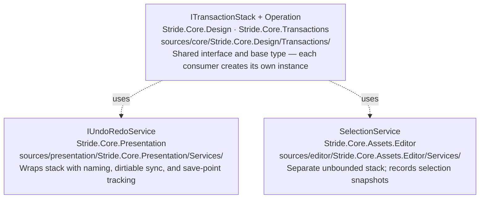

# Editor Framework — Overview

Stride's editor is built on a ViewModel layer that sits above Quantum and the asset system. Every mutation goes through a transaction stack that feeds undo/redo. A separate selection history stack, sharing the same low-level infrastructure, powers back/forward navigation. Both systems use `ITransactionStack` and `Operation` from the `Stride.Core.Transactions` namespace (assembly: `Stride.Core.Design`).

## Shared Infrastructure

## Projects

The editor codebase spans `sources/presentation/` (MVVM framework, Quantum-to-UI binding, shared controls) and `sources/editor/` (editor infrastructure and concrete asset editors). ViewModels are platform-agnostic; WPF coupling belongs in XAML files, code-behind, and WPF-specific service implementations. See [projects.md](projects.md) for the full project map and assembly reference.

## When You Need These Systems

> **Decision tree:**
>
> - Wrapping a property or collection mutation so it is undoable?
>   → **`IUndoRedoService.CreateTransaction()` + `AnonymousDirtyingOperation`.** See [undo-redo.md](undo-redo.md).
>
> - Writing a reusable operation that merges consecutive edits on the same target?
>   → **`DirtyingOperation` subclass + `IMergeableOperation`.** See [undo-redo.md](undo-redo.md).
>
> - Tracking which objects are "dirty" (unsaved) after changes?
>   → **`IDirtiable` / `DirtiableManager`.** See [undo-redo.md](undo-redo.md).
>
> - Mutating a value through a Quantum node presenter (property grid edit)?
>   → **No `PushOperation` needed** — `ContentValueChangeOperation` is pushed automatically by the Quantum infrastructure. See [undo-redo.md](undo-redo.md#how-quantum-feeds-the-stack-automatically).
>
> - Understanding how back/forward selection history works?
>   → **`SelectionService`.** See [navigation.md](navigation.md).
>
> - Creating a dedicated editing surface for a new asset type?
>   → **Write a custom editor.** See [custom-editor.md](custom-editor.md).
>
> - Understanding or modifying an existing editor?
>   → **Existing editors catalogue.** See [editors.md](editors.md).

## Spoke Files

| File | Covers |
|---|---|
| [undo-redo.md](undo-redo.md) | `ITransactionStack`, `IUndoRedoService`, `DirtyingOperation`, `IMergeableOperation`, `IDirtiable`, dirty-flag synchronisation |
| [navigation.md](navigation.md) | `SelectionService`, selection history snapshots, back/forward navigation |
| [projects.md](projects.md) | Project inventory, WPF boundary rule, assembly map |
| [custom-editor.md](custom-editor.md) | Custom asset editor: base class, registration, lifecycle, services, MVVM patterns |
| [editors.md](editors.md) | Existing editors catalogue: SpriteSheet, Scene, Prefab, UIPage, UILibrary, GraphicsCompositor, Script, VisualScript |
