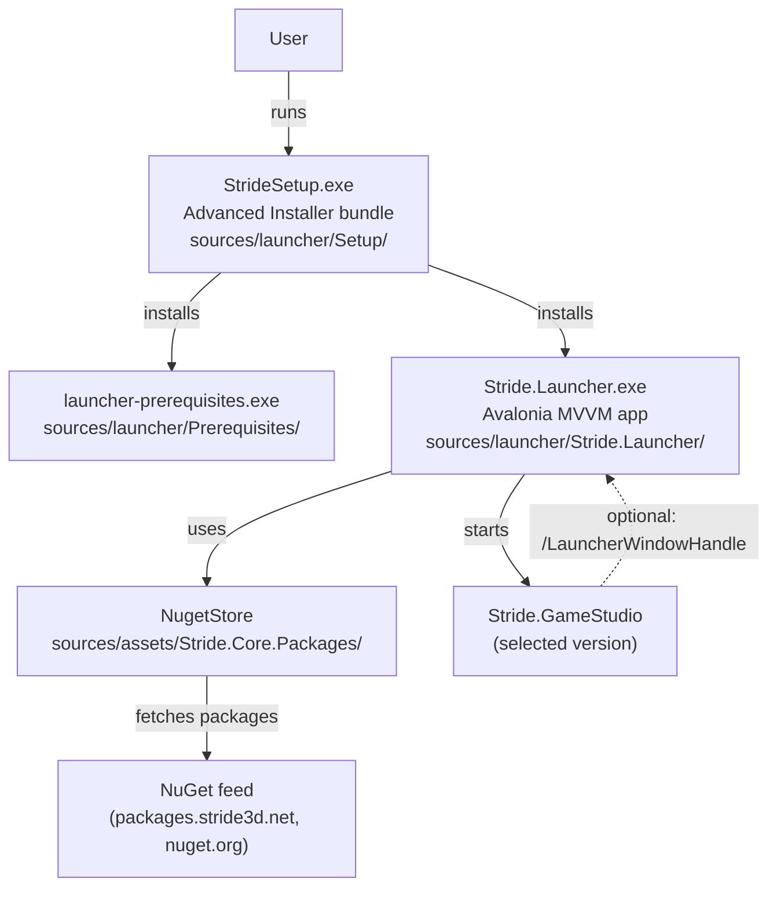

# Stride Launcher — Overview

The Stride Launcher is the entry point end users run after installing Stride. It is an Avalonia MVVM application that manages the locally installed Stride/Xenko versions (download, update, uninstall), exposes recent projects and VSIX extensions for Visual Studio, surfaces release notes, news and documentation, and finally starts the selected version of Game Studio.

The launcher's sources live in [sources/launcher/](../../sources/launcher/). The application itself is [Stride.Launcher](../../sources/launcher/Stride.Launcher/), built against `net10.0` with RIDs `linux-x64` and `win-x64`. It is distributed as a NuGet package (`Stride.Launcher`) and wrapped by an Advanced Installer setup on Windows.

## Big picture

The launcher has three responsibilities:

1. **Self-update.** On start, check NuGet for a newer `Stride.Launcher` package and optionally replace the current executable before the UI is shown. See [self-update.md](self-update.md).
2. **Version management.** List available Stride versions, download/install/uninstall them through `NugetStore`, and track a single "active" version. See [versions.md](versions.md).
3. **Launch Game Studio.** Locate the main executable of the active version, start it with the right arguments, and optionally auto-close when Game Studio signals back via `/LauncherWindowHandle`. See [lifecycle.md](lifecycle.md).

## Projects

The launcher codebase is small and self-contained under [sources/launcher/](../../sources/launcher/):

| Directory | Role |
|---|---|
| [Stride.Launcher/](../../sources/launcher/Stride.Launcher/) | Avalonia MVVM application (`Stride.Launcher.exe`) |
| [Prerequisites/](../../sources/launcher/Prerequisites/) | Advanced Installer project producing `launcher-prerequisites.exe` (Windows only) |
| [Setup/](../../sources/launcher/Setup/) | Advanced Installer project producing the user-facing `StrideSetup.exe` bundle (Windows only) |

The launcher depends on two Stride libraries:

- [Stride.Core.Packages](../../sources/assets/Stride.Core.Packages/) — the `NugetStore` abstraction used to talk to NuGet feeds.
- [Stride.Core.Presentation.Avalonia](../../sources/presentation/Stride.Core.Presentation.Avalonia/) — the shared Avalonia MVVM framework (dispatcher, dialogs, markdown viewer integration, etc.). The WPF equivalent in the editor is `Stride.Core.Presentation.Wpf`.

A handful of files from the editor are linked in directly (not as project references) to keep the launcher dependency graph minimal:

- `EditorPath.cs` — resolves user data paths (`LauncherSettings.conf`, `launcher.lock`, MRU, etc.).
- `PackageSessionHelper.Solution.cs` — parses `.sln` files to discover the Stride version used by a recent project.
- The `Stride.Core.MostRecentlyUsedFiles` shared project — shared MRU list infrastructure.

See [projects.md](projects.md) for the full layout and each file's role.

## When you need these systems

> **Decision tree:**
>
> - Adding a new UI page/tab or a new version-list entry kind?
>   → **A new ViewModel + View under Stride.Launcher.** See [viewmodels.md](viewmodels.md) and [views.md](views.md).
>
> - Changing how a Stride version is downloaded, updated, or uninstalled?
>   → **`StrideVersionViewModel` and `PackageVersionViewModel`** — they drive `NugetStore`. See [versions.md](versions.md).
>
> - Changing how the launcher updates itself?
>   → **`SelfUpdater`** and the self-update window. See [self-update.md](self-update.md).
>
> - Adding a new command-line argument or action?
>   → **`LauncherArguments` + `Launcher.ProcessArguments`.** See [lifecycle.md](lifecycle.md#command-line-arguments).
>
> - Persisting a new user preference?
>   → **`LauncherSettings`** (launcher-owned) or **`GameStudioSettings`** (shared with Game Studio). See [settings.md](settings.md).
>
> - Adding a new localized string or URL?
>   → **`Assets/Localization/Strings.resx` / `Urls.resx`** (+ `.ja-JP` variants). See [localization.md](localization.md).
>
> - Working on the Windows installer or prerequisites bundle?
>   → **Advanced Installer projects under `Prerequisites/` and `Setup/`.** See [packaging.md](packaging.md).
>
> - Running/debugging on Linux and something behaves differently?
>   → **Platform-specific code paths.** See [cross-platform.md](cross-platform.md).

## Spoke files

| File | Covers |
|---|---|
| [projects.md](projects.md) | Directory and file layout, external dependencies, linked files |
| [lifecycle.md](lifecycle.md) | Entry point, single-instance mutex, command-line arguments, error codes, crash reporting |
| [viewmodels.md](viewmodels.md) | `MainViewModel`, version view models, recent projects, news/docs/announcement view models |
| [views.md](views.md) | XAML views, windows, converters, markdown viewer integration |
| [versions.md](versions.md) | Version discovery, install/uninstall flow through `NugetStore`, framework selection, beta filter, dev redirects |
| [self-update.md](self-update.md) | Launcher self-update: NuGet update probe, force-reinstall, file swap, restart |
| [settings.md](settings.md) | `LauncherSettings`, `GameStudioSettings`, config file locations |
| [localization.md](localization.md) | `Strings.resx` / `Urls.resx`, designer classes, adding a new language |
| [packaging.md](packaging.md) | `Stride.Launcher.nuspec`, Advanced Installer projects, `StrideSetup.exe`, versioning |
| [cross-platform.md](cross-platform.md) | Windows-only code paths, Registry usage, Linux/macOS porting status (xplat-launcher) |
