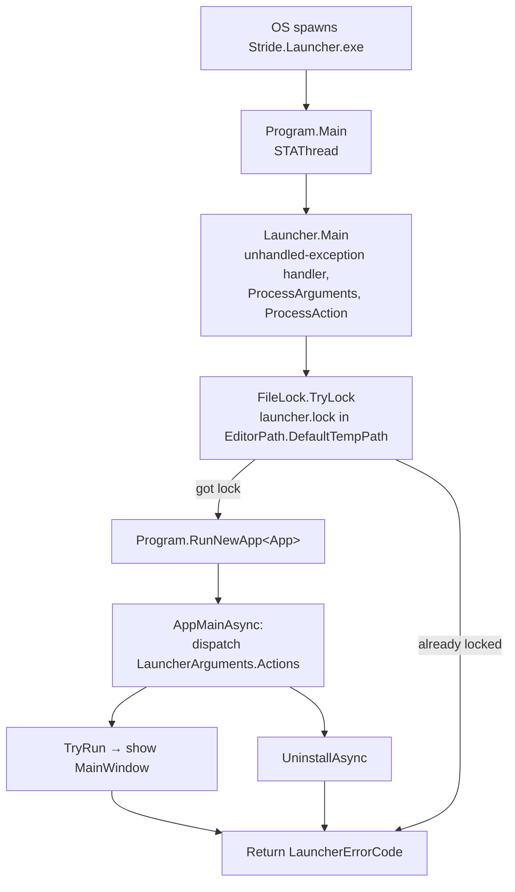

# Launcher Lifecycle

This file covers what happens from the moment the operating system starts `Stride.Launcher.exe` until it exits — process entry, single-instance enforcement, argument parsing, app startup, Game Studio launch, and crash reporting.

## Entry point



- [Program.cs](../../sources/launcher/Stride.Launcher/Program.cs) is the `[STAThread]` entry point. It immediately delegates to `Launcher.Main` and casts the `LauncherErrorCode` enum to `int` for the process exit code.
- [Launcher.cs](../../sources/launcher/Stride.Launcher/Launcher.cs) installs an `AppDomain.UnhandledException` handler, parses arguments, and dispatches to the right action.

## Single-instance enforcement

`Launcher.ProcessAction` acquires a `FileLock` over `{EditorPath.DefaultTempPath}/launcher.lock` (see `Stride.Core.IO.FileLock`). The lock is stored in the static `Launcher.Mutex` so the self-updater can release it before spawning a replacement process. If the lock is already held, the launcher pops up a warning dialog through a separate minimal Avalonia app and returns `LauncherErrorCode.ServerAlreadyRunning` (value `1`).

## Command-line arguments

[LauncherArguments.cs](../../sources/launcher/Stride.Launcher/LauncherArguments.cs) defines the argument model. Arguments are parsed by `Launcher.ProcessArguments`:

| Argument | Meaning |
|---|---|
| *(none)* | Default action — show the launcher window and manage versions |
| `/Uninstall` | Clears all other actions and runs `UninstallAsync` |
| `/UpdateTargets` | Appended by `SelfUpdater.RestartApplication` after a self-update (currently not interpreted separately from the default Run) |
| `/LauncherWindowHandle <hwnd>` | **Outgoing**, not incoming — the launcher passes this to Game Studio when `AutoCloseLauncher` is on, so Game Studio can signal back |

To add a new action:

1. Add a value to `LauncherArguments.ActionType`.
2. Parse it in `Launcher.ProcessArguments`.
3. Handle it in the `AppMainAsync` switch inside `Launcher.ProcessAction`.
4. Reserve a new error code range in [LauncherErrorCode.cs](../../sources/launcher/Stride.Launcher/LauncherErrorCode.cs).

## Error codes

Exit codes are defined in [LauncherErrorCode.cs](../../sources/launcher/Stride.Launcher/LauncherErrorCode.cs). The convention is:

- `0` → `Success`
- **Positive** → non-error outcomes (`ServerAlreadyRunning = 1`)
- **Negative** → errors, grouped by action:
  - `-1..-100` — RunServer errors
  - `-101..-200` — UpdateTargets errors
  - `-201..-300` — Uninstall errors
  - `-10000` — `UnknownError`

External installers and wrappers rely on these codes to decide whether to retry, surface a dialog, etc.

## App startup

Once the lock is acquired, `Program.RunNewApp<App>` builds the Avalonia app:

```csharp
AppBuilder.Configure<App>()
    .UsePlatformDetect()
    .WithInterFont()
    .LogToTrace();
```

[App.axaml.cs](../../sources/launcher/Stride.Launcher/App.axaml.cs) then:

1. Attaches Avalonia dev tools in Debug builds.
2. Initializes the global MarkView/Markdig pipeline (alert blocks, footnotes, figures, Mermaid, SVG, TextMate highlighting, link handler that opens URLs via `ShellExecute`).
3. Creates the `ViewModelServiceProvider` with a `DispatcherService` and a `DialogService`.
4. Instantiates `MainViewModel` and wires it as `MainWindow.DataContext`.

`MinimalApp : App` (same file) is a cut-down app used for secondary windows (crash report, "already running" message, self-update progress). It overrides `OnFrameworkInitializationCompleted` to a no-op so nothing is built beyond what the caller schedules.

## Game Studio launch

Clicking **Start** invokes `MainViewModel.StartStudio(string argument)`:

1. If `AutoCloseLauncher` is on, the launcher prepends `/LauncherWindowHandle {MainViewModel.WindowHandle} ` to the argument string so Game Studio can message it back.
2. `ActiveVersion.LocateMainExecutable()` resolves the path — preferring `{SelectedFramework}` under `tools/` or `lib/`, falling back to legacy paths (`lib/net472/Stride.GameStudio.exe`, `Bin/Windows/Xenko.GameStudio.exe`).
3. On `.dll` targets the launcher runs `dotnet <path> <args>`; otherwise it runs the executable directly. `WorkingDirectory` is set to the directory of the executable so `global.json` resolves correctly.
4. The command is disabled for five seconds to debounce double-clicks, then re-enabled if the version is still `CanStart`.
5. The active version is persisted through `LauncherSettings.ActiveVersion`.

`MainViewModel.WindowHandle` is a static `IntPtr` set by the view code-behind once the main window is realized — the launcher keeps it on a static so the dialog helpers can reach it without plumbing through another service.

## Crash reporting

Two entry points feed the same pipeline:

- `Launcher.Main`'s `try/catch` (synchronous exceptions during argument parsing / action dispatch).
- `AppDomain.CurrentDomain.UnhandledException` (asynchronous exceptions).

Both call `HandleException`, which:

1. Uses `Interlocked.CompareExchange` on `terminating` to make sure we report only once.
2. Forces `en-US` culture so the report is reproducible.
3. Builds a `CrashReportArgs` with the exception, the crash location, and the current thread name.
4. Calls `CrashReport`, which spins up a `MinimalApp`, shows a `CrashReportWindow` bound to a `CrashReportViewModel`, and blocks until it is closed.

The UI lives under [Crash/](../../sources/launcher/Stride.Launcher/Crash/) — see [views.md](views.md#crash-report).
