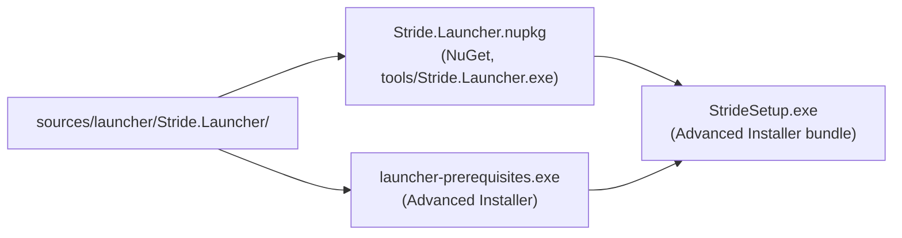

# Packaging & Distribution

The launcher is shipped three different ways, each with its own build artifact. This file describes what is produced, where it comes from, and what to update when versions change.

## Artifacts



| Artifact | Source | Consumed by |
|---|---|---|
| `Stride.Launcher.exe` | `dotnet build Stride.Launcher.csproj` | `Stride.Launcher.nuspec` and `StrideSetup.exe` |
| `Stride.Launcher.nupkg` | `Stride.Launcher.nuspec` + `msbuild /t:Pack` | `SelfUpdater` — used to pull in-place updates |
| `launcher-prerequisites.exe` | `Prerequisites/launcher-prerequisites.aip` | `Stride.Launcher.nuspec` (embedded at `tools/Prerequisites/`) |
| `StrideSetup.exe` | `Setup/setup.aip` | End users (first-time install) |

## Version source of truth

The single place to bump the launcher version is [Stride.Launcher.nuspec](../../sources/launcher/Stride.Launcher/Stride.Launcher.nuspec)'s `<version>` element. The csproj reads it at build time:

```xml
<_StrideLauncherNuSpecLines>$([System.IO.File]::ReadAllText('$(MSBuildThisFileDirectory)Stride.Launcher.nuspec'))</_StrideLauncherNuSpecLines>
<Version>$([System.Text.RegularExpressions.Regex]::Match($(_StrideLauncherNuSpecLines), `<version>(.*)</version>`).Groups[1].Value)</Version>
```

So `Stride.Launcher.exe`'s `AssemblyInformationalVersion` — which `SelfUpdater` compares against NuGet — always matches the nuspec.

The Advanced Installer projects (`.aip`) store their own version independently; remember to bump it when shipping a new setup.

## Stride.Launcher.nuspec

```xml
<files>
    <file src="Stride.Launcher.exe" target="tools" />
    <file src="..\..\..\..\Prerequisites\launcher-prerequisites.exe" target="tools\Prerequisites" />
</files>
```

Two conventions matter here:

- Everything that must land next to the exe goes under `tools/` — `SelfUpdater.UpdateLauncherFiles` hard-codes `const string directoryRoot = "tools/"` and ignores anything outside it.
- The prerequisites installer sits in `tools/Prerequisites/` because `StrideStoreVersionViewModel.RunPrerequisitesInstaller` probes there to run it on first install.

The `<description>` element is special: `SelfUpdater` scans it for a `force-reinstall:` line. See [self-update.md](self-update.md#version-probe). The line that currently ships in the nuspec is used internally; do not remove it.

## Advanced Installer projects

### Prerequisites/

[Prerequisites/launcher-prerequisites.aip](../../sources/launcher/Prerequisites/launcher-prerequisites.aip) builds a chainer that installs:

- The .NET Desktop Runtime required by Game Studio.
- DirectX redistributables (matched to the cab files under [Setup/DirectX11/](../../sources/launcher/Setup/DirectX11/)).
- Any other runtime shims Stride expects on a fresh Windows machine.

The output `launcher-prerequisites.exe` is bundled **inside** the launcher NuGet package at `tools/Prerequisites/`, so a self-update can ship an updated prerequisites bootstrapper too.

### Setup/

[Setup/setup.aip](../../sources/launcher/Setup/setup.aip) is the user-facing installer that downloads `StrideSetup.exe` from `stride3d.net`. It installs:

- `Stride.Launcher.exe` and its dependencies (unpacked into the installed tools dir).
- A Start menu shortcut with `Launcher.ico`.
- A registry entry so the self-updater can detect the install.

## Building the installers

The Advanced Installer projects need `AdvancedInstaller.com` on `PATH`; the automated build is driven by `Stride.build` at the repo root. Locally:

```
msbuild sources\launcher\Stride.build /t:Build;PackageInstaller
```

`Build` produces `Stride.Launcher.exe`; `PackageInstaller` runs Advanced Installer against the two `.aip` files.

On Linux and macOS there is no installer story — the launcher is run from a `dotnet publish -r linux-x64 --self-contained` output. The Advanced Installer targets silently skip when `AdvancedInstaller.com` is absent.

## CI notes

The launcher CI job is in the main GitHub Actions pipeline. There is a dedicated fix for a parallel-build race — see the commit `ci: fix potential parallel build issue for the launcher job` on this branch. When modifying csproj / nuspec interactions, rerun a full clean build to make sure the regex version probe still picks up the right value.
