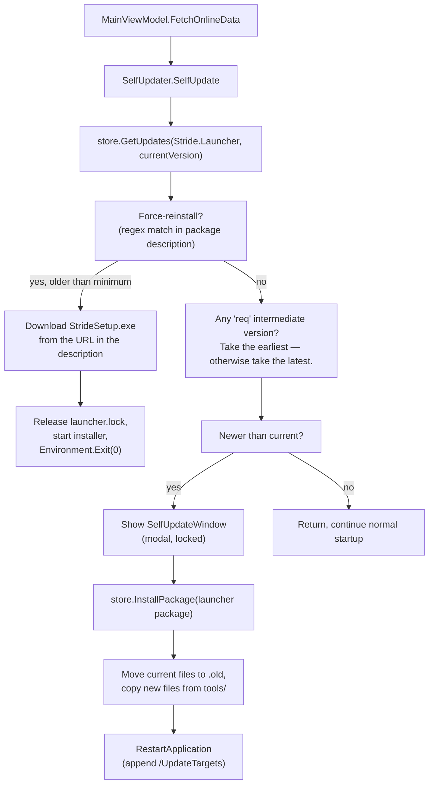

# Launcher Self-Update

[SelfUpdater.cs](../../sources/launcher/Stride.Launcher/Services/SelfUpdater.cs) is responsible for keeping the launcher itself up to date. It runs early during startup, before the user can interact with the main window, because some updates must complete before the regular UI is allowed to touch `NugetStore`.

## Flow

## Version probe

`SelfUpdater.Version` is read once from the assembly's `AssemblyInformationalVersionAttribute`. The package id is taken from `AssemblyProductAttribute.Product` — keep these MSBuild properties in sync with `Stride.Launcher.nuspec`.

`store.GetUpdates` returns candidate packages newer than the current version. The updater walks them twice:

1. **Force-reinstall probe.** If any candidate's `Description` contains a line matching `force-reinstall:\s*(\S+)\s*(\S+)` and the current version is below the declared minimum, the launcher downloads the setup from the URL in the match and hands off to the installer. This is how the launcher reboots across breaking changes that a plain file swap cannot handle. The nuspec description in [Stride.Launcher.nuspec](../../sources/launcher/Stride.Launcher/Stride.Launcher.nuspec) contains a sample line; do not remove it — it is used internally.
2. **Required intermediate probe.** A candidate with `SpecialVersion == "req"` is taken as a mandatory intermediate step. Otherwise the latest candidate is taken directly. This lets you ship a one-off "req" release that every client must pass through.

## File swap

When an in-place update is possible:

1. A `SelfUpdateWindow` is shown modally on top of the main window; `LockWindow()` disables its close button for the duration.
2. `NugetStore.InstallPackage` downloads the package.
3. `package.GetFiles()` is filtered to entries under `tools/` (must match the layout in [Stride.Launcher.nuspec](../../sources/launcher/Stride.Launcher/Stride.Launcher.nuspec) — `<file src="Stride.Launcher.exe" target="tools" />`).
4. Each target file (the launcher exe, its `.config`, and everything in `tools/`) is first moved to `<file>.old`, then replaced. If any copy throws, every `.old` is rolled back.
5. `store.PurgeCache()` clears NuGet's stream cache so subsequent launches don't reopen the old package.
6. `RestartApplication` adds `/UpdateTargets` to `args`, releases `Launcher.Mutex`, starts a new process with `UseShellExecute = true`, and calls `Environment.Exit(0)`.

## Mutex release

Both the force-reinstall and the file-swap paths must release `Launcher.Mutex` before spawning the replacement process — otherwise the newly-started launcher would hit `ServerAlreadyRunning` and bail out. Every `Process.Start` call in `SelfUpdater` is immediately preceded by `Launcher.Mutex?.Dispose()`.

## Failure modes

- **HTTP failure in force-reinstall.** Shows a `MessageBox` with `Strings.NewVersionDownloadError`; the launcher keeps running against the old version.
- **Partial file swap.** `.old` files are renamed back and the exception is re-thrown. `SelfUpdateWindow.ForceClose()` drops the modal, then `MainViewModel.FetchOnlineData` shows the full error (with `LogMessages`).
- **No network at all.** `FetchOnlineData`'s catch swallows `HttpRequestException` so the launcher still starts in offline mode. Any other failure calls `Environment.Exit(1)` — the product decision is that running against a known-broken launcher is worse than not running.

## Testing

Self-update is hard to test end-to-end. For local iteration:

1. Build a `Stride.Launcher` package with a bumped version via `PackageLauncher-Debug.bat`.
2. Point a local NuGet feed at the output.
3. Add the feed in `nuget.config` and relaunch the installed launcher.

For force-reinstall paths, add a matching `force-reinstall:` line to the description in a throwaway nuspec and host the referenced URL on a local HTTP server.
