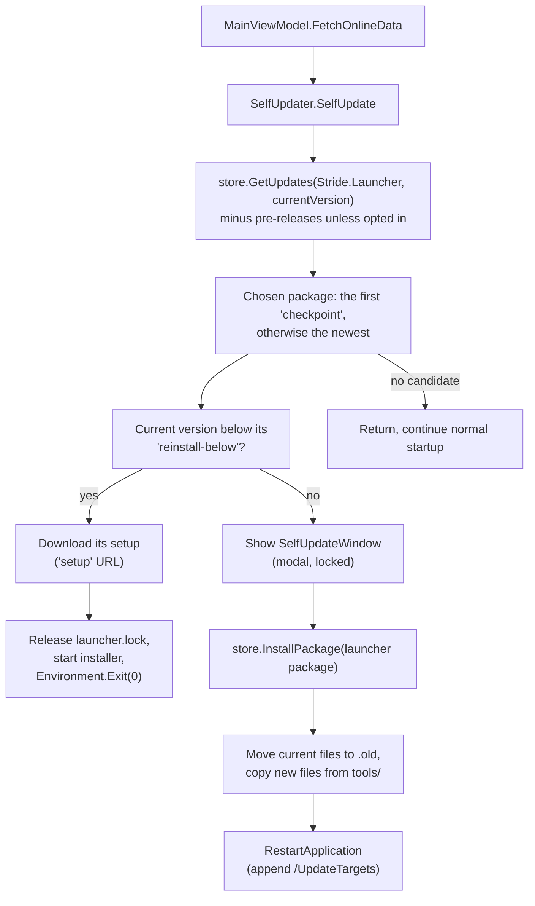

# Launcher Self-Update

[SelfUpdater.cs](../../sources/launcher/Stride.Launcher/Services/SelfUpdater.cs) is responsible for keeping the launcher itself up to date. It runs early during startup, before the user can interact with the main window, because some updates must complete before the regular UI is allowed to touch `NugetStore`.

## Flow


```mermaid
flowchart TD
    Start["MainViewModel.FetchOnlineData"]
    Self["SelfUpdater.SelfUpdate"]
    Updates["store.GetUpdates(Stride.Launcher, currentVersion)<br/>minus pre-releases unless opted in"]
    Choose["Chosen package: the first 'checkpoint',<br/>otherwise the newest"]
    Reinstall["Current version below its<br/>'reinstall-below'?"]
    DL["Download its setup<br/>('setup' URL)"]
    RunInstaller["Release launcher.lock,<br/>start installer,<br/>Environment.Exit(0)"]
    Show["Show SelfUpdateWindow<br/>(modal, locked)"]
    Install["store.InstallPackage(launcher package)"]
    Swap["Move current files to .old,<br/>copy new files from tools/"]
    Restart["RestartApplication<br/>(append /UpdateTargets)"]
    Skip["Return, continue normal startup"]

    Start --> Self --> Updates --> Choose
    Choose -- "no candidate" --> Skip
    Choose --> Reinstall
    Reinstall -- "yes" --> DL --> RunInstaller
    Reinstall -- "no" --> Show --> Install --> Swap --> Restart
```

## Version probe

`SelfUpdater.Version` is read once from the assembly's `AssemblyInformationalVersionAttribute`. The package id is taken from `AssemblyProductAttribute.Product` — keep these MSBuild properties in sync with `Stride.Launcher.nuspec`.

`store.GetUpdates` returns the packages newer than the current version, pre-releases included. `SelfUpdater.IsUpdateCandidate` then drops the pre-releases unless the user opted in (see [Pre-releases](#pre-releases)).

## Update rules

Each package carries its rules in an `update:` line of its description, filled by [Stride.Launcher.Release.targets](../../sources/launcher/Stride.Launcher.Release.targets):

```
update: [checkpoint] [reinstall-below=<version>] setup=<url>
```

- **`checkpoint`**: every older launcher updates to this package before any newer one, e.g. a version that migrates something the next ones need. Set with the `checkpoint` input of `release-launcher.yml`.
- **`reinstall-below`**: launchers below this version can't reach this package by swapping their files, so they install its setup. Set `StrideLauncherReinstallBelow` in `Stride.Launcher.Release.targets` for such a release, and keep it for the next ones.
- **`setup`**: the setup of this package, on its GitHub release.

`SelfUpdater.ChooseUpdate` takes the first candidate with `checkpoint`, otherwise the newest one. Only the rules of that package count: if the current version is below its `reinstall-below`, the launcher installs its setup (Windows only), otherwise it swaps its files. The rules only apply to the candidates the pre-release filter kept: a pre-release that needs a reinstall only reaches the users who opted in, with its own setup.

Unknown words are skipped, so that a later launcher can add rules without breaking the older ones.

### Launchers before 6.0.1

Older launchers don't read the `update:` line. They read two older mechanisms, which the packages keep for them:

- **`force-reinstall: 5.0.1 <setup>`**: the updater takes the newest package that has this line. Launchers below 5.0.1 install its setup. Every package keeps it with `5.0.1`, which rescues the 4.x launchers (the 5.x packages point to a URL that no longer exists).
- **`-req` versions**: the updater takes the first `-req` version above it before any other one. These launchers have no pre-release filter, so `6.0.1-req` (the same exe as 6.0.1, published with the `legacy-req` input) takes them to 6.0.1 before they see a pre-release. The exe says 6.0.1, so they don't update again to 6.0.1. `release-launcher.yml` refuses to deploy a pre-release until a 6.x `-req` is on NuGet.

## Pre-releases

A launcher pre-release (`6.1.0-beta1`) is built with a version suffix (see [packaging.md](packaging.md#versions)). Only launchers whose user opted in update to it: the launcher settings (the gear in the title bar) have a "Receive launcher pre-releases" check box (`LauncherSettings.IncludePrereleaseUpdates`). The setting applies from the next start; checking right away could run alongside the update check of startup. Turning it off doesn't downgrade: the launcher stays on its pre-release until a newer release comes out.

A pre-release launcher, e.g. installed from its own setup, always takes the newer pre-releases of its own version, then its release: `6.0.1-beta1` gets `6.0.1-beta2` and `6.0.1`, but `6.0.2-beta1` only with the setting on. Once on the release, only the setting decides.

Launchers before 6.0.1 have no such filter: see [Launchers before 6.0.1](#launchers-before-601).

NuGet compares `beta10` before `beta2` (text), so the pre-release number stays from 1 to 9.

## File swap

When an in-place update is possible:

1. A `SelfUpdateWindow` is shown modally on top of the main window; `LockWindow()` disables its close button for the duration.
2. `NugetStore.InstallPackage` downloads the package.
3. `package.GetFiles()` is filtered to entries under `tools/` (must match the layout in [Stride.Launcher.nuspec](../../sources/launcher/Stride.Launcher/Stride.Launcher.nuspec) — `<file src="Stride.Launcher.exe" target="tools" />`).
4. Each target file (the launcher exe, its `.config`, and everything in `tools/`) is first moved to `<file>.old`, then replaced. If any copy throws, every `.old` is rolled back. The running exe's `.old` can't be deleted yet: the new launcher deletes it (and the `.config.old`) when its own update check starts.
5. `store.PurgeCache()` clears NuGet's stream cache so subsequent launches don't reopen the old package.
6. `RestartApplication` adds `/UpdateTargets` to `args`, releases `Launcher.Mutex`, starts a new process with `UseShellExecute = true`, and calls `Environment.Exit(0)`.

## Mutex release

Both the reinstall and the file-swap paths must release `Launcher.Mutex` before spawning the replacement process — otherwise the newly-started launcher would hit `ServerAlreadyRunning` and bail out. Every `Process.Start` call in `SelfUpdater` is immediately preceded by `Launcher.Mutex?.Dispose()`.

## Failure modes

- **HTTP failure in a reinstall.** Shows a `MessageBox` with `Strings.NewVersionDownloadError`; the launcher keeps running against the old version.
- **Partial file swap.** `.old` files are renamed back and the exception is re-thrown. `SelfUpdateWindow.ForceClose()` drops the modal, then `MainViewModel.FetchOnlineData` shows the full error (with `LogMessages`).
- **No network at all.** `FetchOnlineData`'s catch swallows `HttpRequestException` so the launcher still starts in offline mode. Any other failure calls `Environment.Exit(1)` — the product decision is that running against a known-broken launcher is worse than not running.

## Testing

Self-update is hard to test end-to-end. For local iteration:

1. Build a `Stride.Launcher` package with a bumped version via `PackageLauncher-Debug.bat`.
2. Point a local NuGet feed at the output.
3. Add the feed in `nuget.config` and relaunch the installed launcher.

For a reinstall, pack with `UpdateRules=reinstall-below=<version> setup=<url>` and host the setup on a local HTTP server. The choice itself is unit-tested in `SelfUpdaterTests`.
