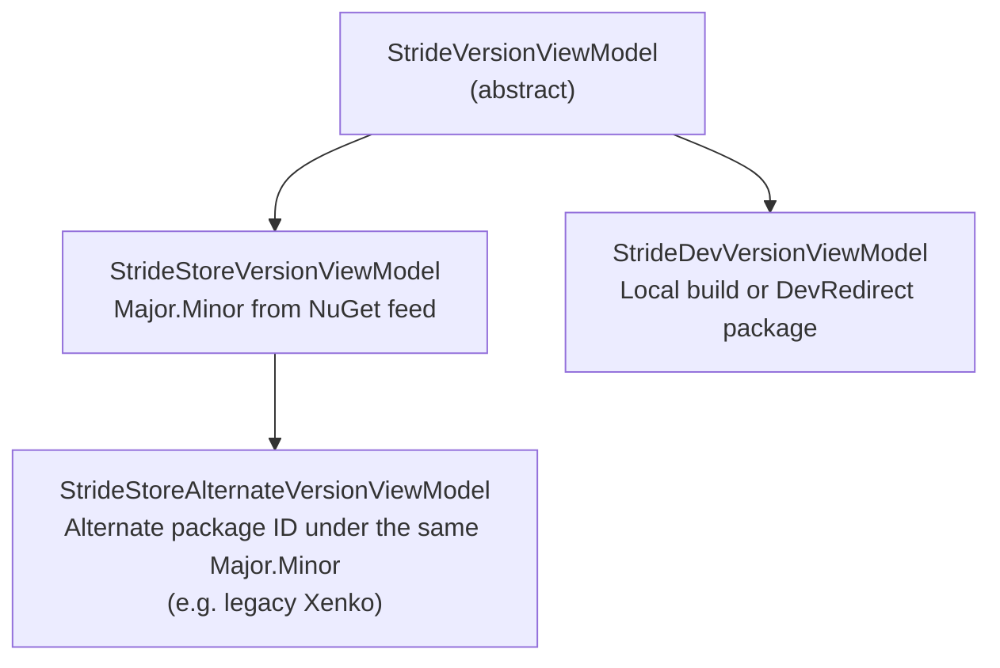

# Stride Versions

Managing Stride versions is the launcher's core responsibility. This file describes how versions are discovered, how install/update/uninstall flows are wired, and where to hook new behavior.

## Version kinds



Each entry in `MainViewModel.StrideVersions` corresponds to one `Major.Minor` pair. A `StrideStoreVersionViewModel` holds both the latest `NugetLocalPackage` installed and the latest `NugetServerPackage` from the feed — that's how the UI knows whether a version is installed, outdated, or download-only.

## Version discovery

`MainViewModel.FetchOnlineData` orchestrates three phases:

1. **Local.** `RetrieveLocalStrideVersions` calls `NugetStore.GetPackagesInstalled(MainPackageIds)` and filters with `FilterStrideMainPackages()` ([PackageFilterExtensions.cs](../../sources/launcher/Stride.Launcher/PackageFilterExtensions.cs)). Packages are grouped by `{Major}.{Minor}`.
2. **Server.** `RetrieveServerStrideVersions` calls `NugetStore.FindSourcePackages(MainPackageIds, …)`. If the call returns nothing, `IsOffline` flips on and the UI shows an error with the accumulated log.
3. **Dev.** Dev-redirect packages (detected via `NugetStore.IsDevRedirectPackage`) are added as `StrideDevVersionViewModel` with their real on-disk path from `NugetStore.GetRealPath`. Additionally, every entry in `LauncherSettings.DeveloperVersions` is added up front.

The same `Major.Minor` key is looked up with `SortedObservableCollection.BinarySearch(Tuple.Create(major, minor))` to merge local and server state into a single view model.

## NuGet store

[Stride.Core.Packages.NugetStore](../../sources/assets/Stride.Core.Packages/NugetStore.cs) is a thin facade over NuGet's v3 APIs. The launcher does not call NuGet directly — every operation goes through `NugetStore`:

| Method | Used by |
|---|---|
| `GetPackagesInstalled(ids)` | `RetrieveLocalStrideVersions` |
| `FindSourcePackages(ids, ct)` | `RetrieveServerStrideVersions`, `VsixVersionViewModel.UpdateFromStore` |
| `InstallPackage(id, version, frameworks, progress)` | `PackageVersionViewModel` download flow, `SelfUpdater` |
| `UninstallPackage(package, progress)` | `PackageVersionViewModel` delete flow, `MainViewModel.RemoveUnusedPackages`, `Launcher.UninstallAsync` |
| `GetUpdates(identity, …)` | `SelfUpdater` |
| `PurgeCache()` | `SelfUpdater` after a file swap |

Every call is serialized through `MainViewModel.RunLockTask`, which takes `objectLock` and runs on a background thread.

Progress is reported via `IPackagesLogger` — `MainViewModel` implements it and stores every log line in-memory so the crash report and the "offline" dialog can attach it.

## Install / update flow

1. User clicks **Install** or **Update** on a `StrideVersionViewModel`.
2. `PackageVersionViewModel.Download(true)` runs: it sets `IsProcessing`, calls `NugetStore.InstallPackage`, and updates progress via `OnDownloadProgress`.
3. On completion, `UpdateStatus` recomputes `CanBeDownloaded` / `CanDelete` and the UI re-binds.
4. `MainViewModel.RetrieveLocalStrideVersions` is re-run to refresh the version list and to clean up any newly-unused transitive packages via `RemoveUnusedPackages` (walks `Dependencies` starting from the Stride/Xenko main packages and uninstalls anything no longer referenced).
5. `UpdateFrameworks()` re-scans `tools/` and `lib/` for TFM subfolders containing a Game Studio executable (`Stride.GameStudio.Avalonia.Desktop.exe` on Windows, `.dll` on Linux). `SelectedFramework` is restored from `LauncherSettings.PreferredFramework` if present, otherwise the closest match (same `Framework` identifier) is used.

## Uninstall flow

Two entry points:

- **Per-version**, from the UI: `PackageVersionViewModel.Delete(removeFromUi: true, confirmPrompt: true)` prompts the user, calls `NugetStore.UninstallPackage`, and updates status.
- **Full uninstall**, from `Stride.Launcher.exe /Uninstall`: [Launcher.cs](../../sources/launcher/Stride.Launcher/Launcher.cs)'s `UninstallAsync`:
  1. Calls `UninstallHelper.CloseProcessesInPathAsync` to kill any running Stride/Game Studio process started from the launcher directory. The user is prompted to confirm via `MessageBox`.
  2. Iterates `store.MainPackageIds` and uninstalls every matching local package.
  3. Cleans `.lock` and `.old` files left over from previous self-updates.
  4. Cancels the app's `CancellationTokenSource` so the main loop exits.

`UninstallHelper` also subscribes to `NugetStore.NugetPackageUninstalling` to close lingering processes before each package is removed — this is why it lives as a disposable member on `MainViewModel` (`uninstallHelper`).

## Beta filter

`StrideVersionViewModel.IsBetaVersion(major, minor)` returns `true` for `major < 3`. Beta versions are visible only when `MainViewModel.ShowBetaVersions` is on or when the version is already installed. The UI toggle re-raises `UpdateStatus` for every version.

## Framework selection

`StrideVersionViewModel.Frameworks` is an `ObservableList<string>` populated by scanning the package install path. The launcher looks for:

```
{InstallPath}/tools/{framework}/Stride.GameStudio.Avalonia.Desktop.{exe|dll}
{InstallPath}/lib/{framework}/Stride.GameStudio.Avalonia.Desktop.{exe|dll}
```

On Windows, `Stride.GameStudio.exe` and legacy `Xenko.GameStudio.exe` are also considered. See `StrideVersionViewModel.GetExecutableNames` and `LocateMainExecutable`.

## VSIX

`VsixVersionViewModel` treats the VSIX as just another NuGet package but overrides the install step to invoke `VSIXInstaller.exe` against the detected `VisualStudioVersions.AvailableInstances` matching the supported range (`VS2019` for major 16, `VS2022AndNext` for major ≥ 17). Two instances exist on `MainViewModel`: `VsixPackage2019` and `VsixPackage2022`.

## Adding a new version kind

1. Create a subclass of `StrideVersionViewModel` (or `StrideStoreVersionViewModel` for "looks like a store version but from a different source").
2. Override `UpdateStatus` to describe when the entry is downloadable vs installed.
3. Populate it from `MainViewModel` — either from a settings source (like `LauncherSettings.DeveloperVersions`) or from a new NuGet query.
4. If the UI needs to distinguish it, add a DataTemplate in `MainView.axaml` keyed on the concrete type.
