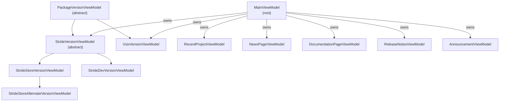

# Launcher ViewModels

The launcher's MVVM layer lives under [sources/launcher/Stride.Launcher/ViewModels/](../../sources/launcher/Stride.Launcher/ViewModels/). Every view model derives from `DispatcherViewModel` from `Stride.Core.Presentation`, so property change notifications marshal back to the UI thread automatically.

## Hierarchy

## MainViewModel

[MainViewModel.cs](../../sources/launcher/Stride.Launcher/ViewModels/MainViewModel.cs) is the root. It is created once in `App.OnFrameworkInitializationCompleted` and owns everything else.

Key responsibilities:

- **Initialize the NuGet store.** `Launcher.InitializeNugetStore()` constructs a `NugetStore` rooted at the launcher's directory. `MainViewModel` registers itself as `store.Logger` via `IPackagesLogger` so every NuGet operation is captured in the `LogMessages` buffer.
- **Populate `StrideVersions`.** A `SortedObservableCollection<StrideVersionViewModel>` (newest first) combining:
  1. Dev versions from `LauncherSettings.DeveloperVersions`.
  2. Locally installed packages (`RetrieveLocalStrideVersions`).
  3. Packages returned by the NuGet feed (`RetrieveServerStrideVersions`).
- **Track the active version.** `ActiveVersion` persists to `LauncherSettings.ActiveVersion`. When it changes, `StartStudioCommand.IsEnabled` is recomputed from `ActiveVersion.CanStart`.
- **Fetch online content.** `FetchOnlineData` runs the self-updater, then in parallel fetches news pages, release notes, and documentation TOC.
- **First-install experience.** `CheckForFirstInstall` runs the prerequisites installer for already-installed versions, then — on a truly first install — asks the user to install the latest Stride and the appropriate VSIX for their installed Visual Studio.
- **Recent projects.** Subscribes to `GameStudioSettings.RecentProjectsUpdated` and rebuilds `RecentProjects` on the dispatcher.

Commands exposed to the UI:

| Command | Action |
|---|---|
| `InstallLatestVersionCommand` | Download the newest `StrideVersionViewModel` via its own `DownloadCommand` |
| `StartStudioCommand` | Launch Game Studio for `ActiveVersion` (see [lifecycle.md](lifecycle.md#game-studio-launch)) |
| `OpenUrlCommand` | `ShellExecute` a URL (used for social links, docs, news) |
| `ReconnectCommand` | Clear `IsOffline` and re-run `FetchOnlineData` |
| `CheckDeprecatedSourcesCommand` | Add the legacy `packages.stride3d.net` feed to NuGet.config if missing, then restart |

`RunLockTask` serializes every NuGet operation under `objectLock` so two async tasks never hit `NugetStore` concurrently.

## PackageVersionViewModel

[PackageVersionViewModel.cs](../../sources/launcher/Stride.Launcher/ViewModels/PackageVersionViewModel.cs) is the abstract base for anything the launcher downloads from NuGet.

It holds:

- `LocalPackage` / `ServerPackage` — `NugetLocalPackage` / `NugetServerPackage` from `Stride.Core.Packages`.
- `CanBeDownloaded`, `CanDelete`, `IsProcessing`, `CurrentProgress`, `CurrentProgressAction`, `CurrentProcessStatus` — UI-facing flags.
- `DownloadCommand` and `DeleteCommand` — the primary user actions.

Subclasses must implement `Name` and `FullName`, and override `UpdateStatus` to set `CanBeDownloaded` / `CanDelete` based on the local/server pair. The download/delete logic is already in the base class.

## Version view models

- [**StrideVersionViewModel**](../../sources/launcher/Stride.Launcher/ViewModels/StrideVersionViewModel.cs) — abstract base. Adds `Major`/`Minor`, `IsBeta`, `Frameworks` (discovered by scanning `tools/`/`lib/`), `SelectedFramework`, and `LocateMainExecutable()`. `IsBeta` is hard-coded to `major < 3`.
- [**StrideStoreVersionViewModel**](../../sources/launcher/Stride.Launcher/ViewModels/StrideStoreVersionViewModel.cs) — an official release. Holds `ReleaseNotes` and `DocumentationPages`, manages the prerequisites installer (`Bin\Prerequisites\install-prerequisites.exe`), and exposes the VSIX packages.
- [**StrideStoreAlternateVersionViewModel**](../../sources/launcher/Stride.Launcher/ViewModels/StrideStoreAlternateVersionViewModel.cs) — a sibling variant (e.g. legacy Xenko ID) that resolves under the same `StrideStoreVersionViewModel`.
- [**StrideDevVersionViewModel**](../../sources/launcher/Stride.Launcher/ViewModels/StrideDevVersionViewModel.cs) — a local build registered via `LauncherSettings.DeveloperVersions` or a `DevRedirect` package. Never downloadable. Marked as "compatible with every project" in the recent projects list.
- [**VsixVersionViewModel**](../../sources/launcher/Stride.Launcher/ViewModels/VsixVersionViewModel.cs) — installs/uninstalls the Stride Visual Studio extension in the detected VS instances via `Stride.Core.CodeEditorSupport.VisualStudio.VisualStudioVersions`.

See [versions.md](versions.md) for the full install/uninstall flow.

## Recent projects

[RecentProjectViewModel.cs](../../sources/launcher/Stride.Launcher/ViewModels/RecentProjectViewModel.cs) wraps a single MRU entry:

- `DiscoverStrideVersion()` runs async on a background thread and parses the `.sln` file through `PackageSessionHelper` to detect which Stride version the project targets.
- `CompatibleVersions` lists the locally-installed versions that can open the project (dev versions are always considered compatible; store versions must be ≥ the project's declared version).
- Commands: `OpenCommand` (open with active version), `OpenWithCommand` (open with a chosen version), `ExploreCommand` (show in file explorer), `RemoveCommand` (remove from MRU via `GameStudioSettings.RemoveMostRecentlyUsed`).

## Content view models

- [**NewsPageViewModel**](../../sources/launcher/Stride.Launcher/ViewModels/NewsPageViewModel.cs) — fetches the RSS feed at `Urls.RssFeed`, parses `<title>`, `<description>`, `<pubDate>`, `<link>`. `FetchNewsPages(IViewModelServiceProvider, int)` returns up to *n* entries.
- [**DocumentationPageViewModel**](../../sources/launcher/Stride.Launcher/ViewModels/DocumentationPageViewModel.cs) — fetches the "Getting Started" HTML index and extracts its links. Tied to a specific Stride version so the right doc branch is shown.
- [**ReleaseNotesViewModel**](../../sources/launcher/Stride.Launcher/ViewModels/ReleaseNotesViewModel.cs) — lazy-loads markdown release notes; has `IsLoading`/`IsLoaded`/`IsUnavailable` flags and a `ToggleCommand` to expand/collapse.
- [**AnnouncementViewModel**](../../sources/launcher/Stride.Launcher/ViewModels/AnnouncementViewModel.cs) — loads a markdown announcement from an embedded resource. Uses `MainViewModel.HasDoneTask` / `SaveTaskAsDone` so "don't show again" is persisted per announcement. Currently `MainViewModel.DisplayReleaseAnnouncement` is an empty placeholder — wire announcements here.

## Converter

[FrameworkConverter.cs](../../sources/launcher/Stride.Launcher/ViewModels/FrameworkConverter.cs) is a one-way value converter that renders a NuGet framework folder name (`net10.0-windows`) as a human-readable label (`.NET 10.0 (Windows)`). It lives in the ViewModels folder rather than Views because it is consumed by bindings alongside `SelectedFramework`.

## Threading notes

- Mutations that touch `strideVersions` go through `Dispatcher.Invoke` / `Dispatcher.InvokeAsync` because the UI observes the collection.
- All NuGet calls go through `MainViewModel.RunLockTask` to serialize access.
- `strideVersions` is a `SortedObservableCollection`; never `Add` into an index — it sorts itself.
