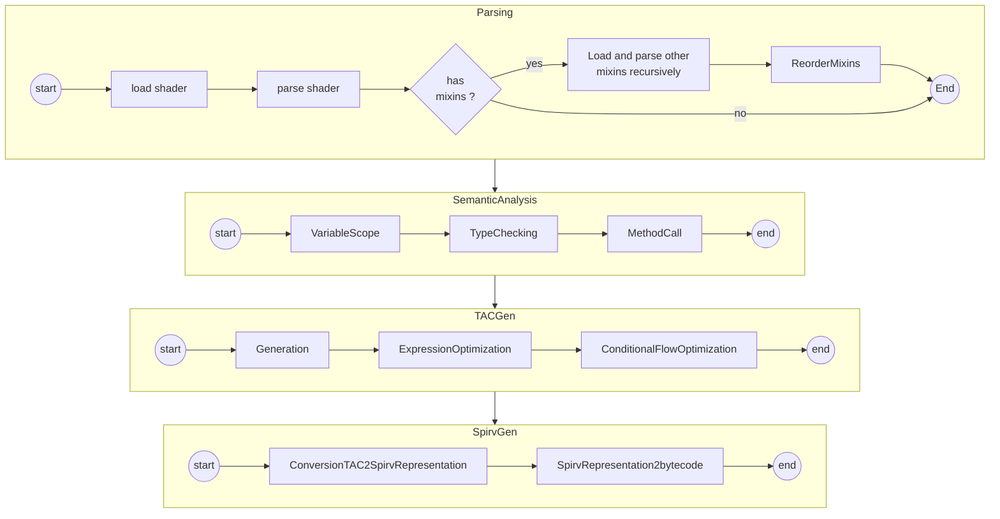
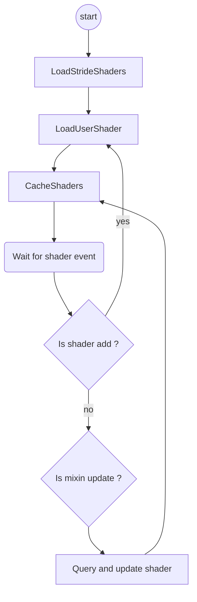
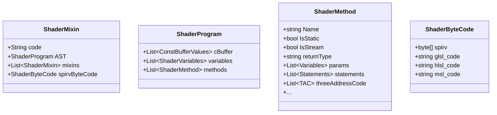

# Compilation process

## Parsing

```mermaid
flowchart TB
    subgraph Parsing
        StartParsing((start)) --> Load
        Load[load shader] --> FirstParse[parse shader]
        FirstParse --> HasMixins{has\n mixins ?}
        HasMixins -->|yes|LoadOtherShaders[Load and parse other\n mixins recursively]
        LoadOtherShaders --> ReorderMixins
        ReorderMixins --> EndParsing((End))
        HasMixins -->|no|EndParsing((End))
    end
    subgraph SemanticAnalysis
        StartSemanticAnalysis((start)) --> VariableScope
        VariableScope --> TypeChecking
        TypeChecking --> MethodCall
        MethodCall --> EndSemanticAnalysis((end))
    end
    subgraph TACGen
        StartTACGen((start)) --> Generation
        Generation --> ExpressionOptimization
        ExpressionOptimization --> ConditionalFlowOptimization
        ConditionalFlowOptimization --> EndTACGen((end))
    end
    subgraph SpirvGen
        StartSpirvGen((start)) --> ConversionTAC2SpirvRepresentation
        ConversionTAC2SpirvRepresentation --> SpirvRepresentation2bytecode
        SpirvRepresentation2bytecode --> EndSpirvGen((end))
    end
    Parsing --> SemanticAnalysis
    SemanticAnalysis --> TACGen
    TACGen --> SpirvGen
```

## Shader caching

```mermaid
flowchart TB
    Start((start)) --> LoadStrideShaders
    LoadStrideShaders --> LoadUserShader
    LoadUserShader --> CacheShaders
    CacheShaders --> ShaderDBEvent(Wait for shader event)
    ShaderDBEvent --> IsShaderAdd{Is shader add ?}
    IsShaderAdd -->|yes| LoadUserShader
    IsShaderAdd -->|no| IsMixinUpdate{Is mixin update ?}
    IsMixinUpdate --> QueryAndUpdate[Query and update shader]
    QueryAndUpdate --> CacheShaders

```

```mermaid
classDiagram
    class ShaderMixin
    ShaderMixin: +String code
    ShaderMixin: +ShaderProgram AST
    ShaderMixin: +List~ShaderMixin~ mixins
    ShaderMixin: +ShaderByteCode spirvByteCode

    class ShaderProgram
    ShaderProgram: +List~ConstBufferValues~ cBuffer
    ShaderProgram: +List~ShaderVariables~ variables
    ShaderProgram: +List~ShaderMethod~ methods

    class ShaderMethod
    ShaderMethod: +string Name
    ShaderMethod: +bool IsStatic
    ShaderMethod: +bool IsStream
    ShaderMethod: +string returnType
    ShaderMethod: +List~Variables~ params
    ShaderMethod: +List~Statements~ statements
    ShaderMethod: +List~TAC~ threeAddressCode
    ShaderMethod: +...

    class ShaderByteCode
    ShaderByteCode: +byte[] spirv
    ShaderByteCode: +string glsl_code
    ShaderByteCode: +string hlsl_code
    ShaderByteCode: +string msl_code
    
    
    
    
    

```